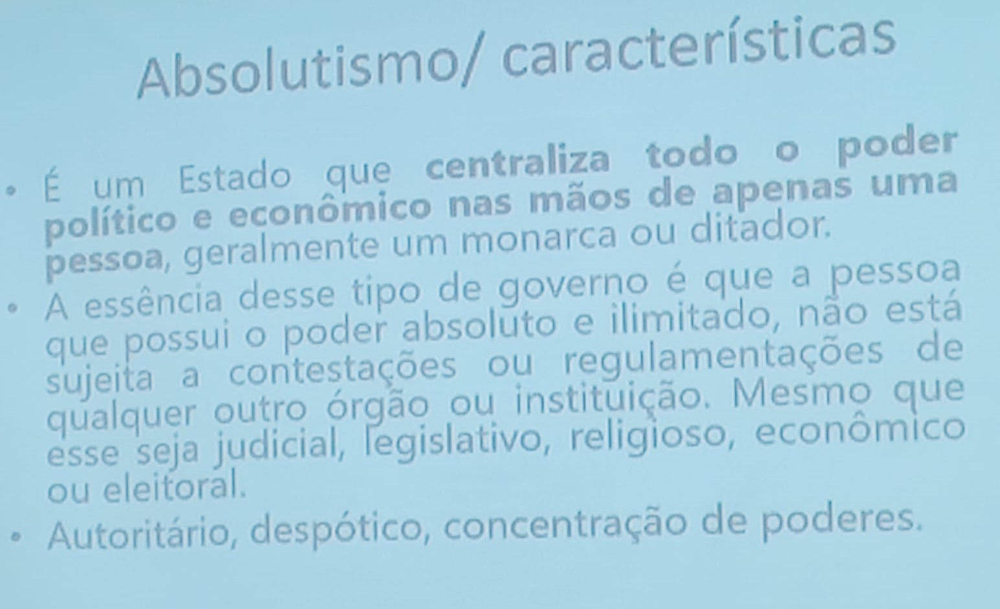
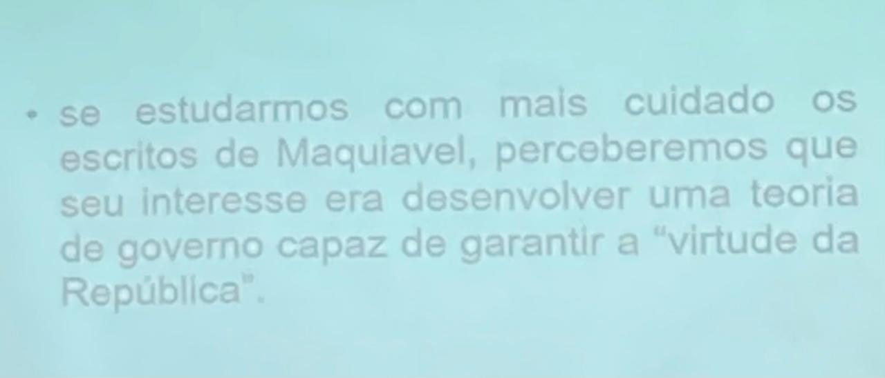
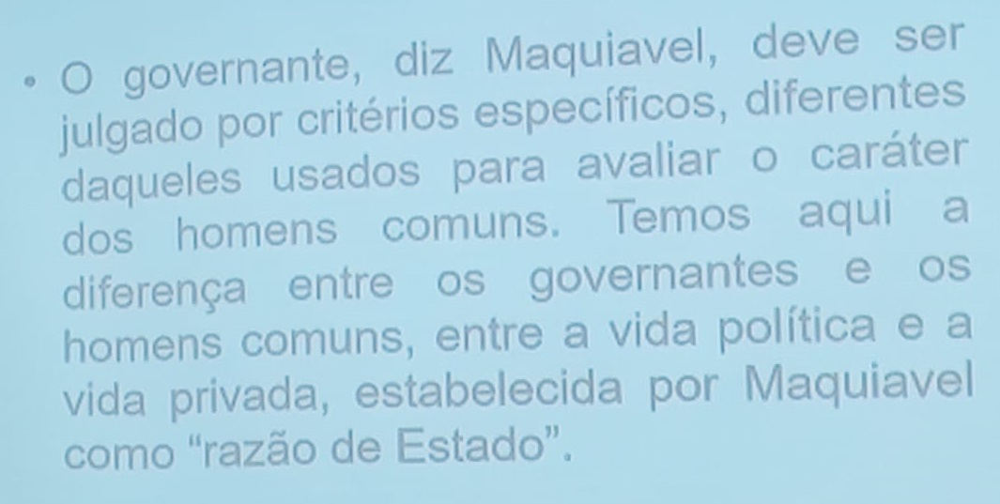
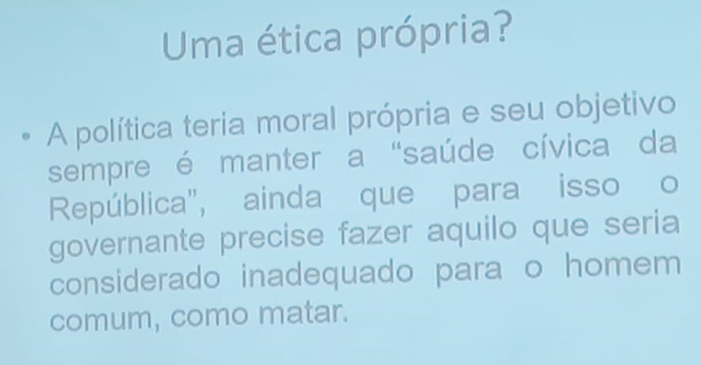
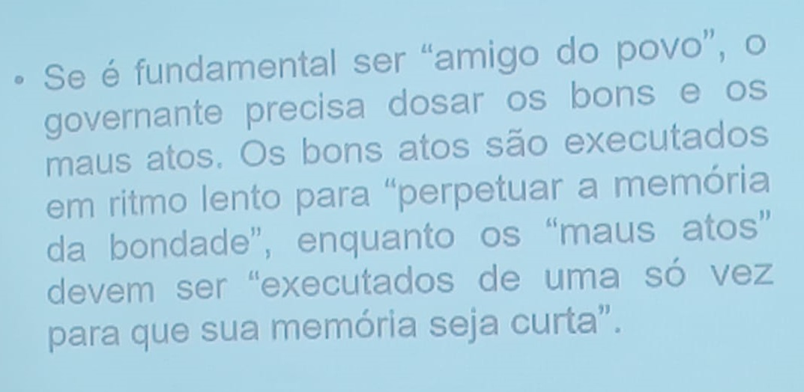

 

<b>CENTRO UNIVERSITÁRIO UNIESP</b> 
<b>Bacharelado em Direito</b> 
<b>Disciplina</b>: CIÊNCIA POLÍTICA 
<b>Professor</b>: JEAN PATRÍCIO DA SILVA 
<b>Data</b>: 05 de março de 2024, Quarta-Feira 
 
<b>Aluno</b>: Daniel Lima Claudino / 1º período 
 

<table align="right" border="0">
  <tr>
    <td align="center" valign="top">
      <a href="../../README.md">
         Início deste  Repositório
      </a>
    </td>
    <td align="center" valign="top">
      <a href="../README.md">
         Sumário da Fonte
      </a>
    </td>
    <td align="center" valign="top">
         Baixar em PDF
    </td>
  </tr>
</table>    

# Notas de Aula 02

## Slide 01

- **Anotações**:
  - Absolutismo (poder absoluto do governante, do rei, poder divino);
  - A atualidade de Maquiavel consiste em pensar a **política** não de uma forma ideal (cristã), mas de uma forma racional, onde "os fins justificam os meios".

## Slide 02

- **Anotações**:
  - Não consegui captar aqui se houve comentário ou não, além do que está no slide. 😰

## Slide 03 - Como o governante deve ser julgado

- **Anotações**:
  - Maquiavel distinguia o **homem comum** e o **homem governante**;
  - Maquiavel defendia que o **homem governante** deve ser superior ao homem comum (pessoa privada) por causa das **razões de Estado**;

## Slide 04 - Uma ética própria

- **Anotações**:
  - Para Maquiavel, o político possui uma ética própria, onde é permitido de tudo para manter o Estado e o seu governo, inclusive matar;

## Slide 05 - Ser amano ou temido ?

- **Anotações**:
  - Segundo maquiavel:
    - O ideal é ser amano e temido ao mesmo tempo;
    - Os atos perversos e ruins:
      - Devem ser feitos de uma vez;
    - Os atos bons:
      - Devem ser paulatinos e a conta gotas 

## 2. Tópicos a serem abordados na próxima aula

- A próxima aula será a **continuação do assunto abordado nesta aula** e ocorrerá em 12/03/2024.
  - Obs: O professor havia combinado de alternar uma semana a disciplina de "Ciência Política" e outras semana "Sociologia Geral e Jurídica".
  - Ele deixou esse aviso em sala hoje.

## 3. Anotações Relevantes Feitas Durante a Aula

- Provas:
  - Duração da prova: 1 hora e meia
  - Serão duas provas no mesmo dia
- Recomendação de Filme
  - [Stalin ("Homem de Aço")](https://filmow.com/stalin-o-homem-de-aco-t60212/)

## 4. Avisos / Observações

- Hoje, foi realizado o **EVENTO DE RECEPÇÃO DOS ALUNOS DO 1º PERÍODO**;

## 5. Material Disponibilizado no Site IESP.Edu.br

- Nenhuma material disponibilizado.

## 6. Referências Bibliográficas

- Não houve referência a material bibliográfico nesta data.
