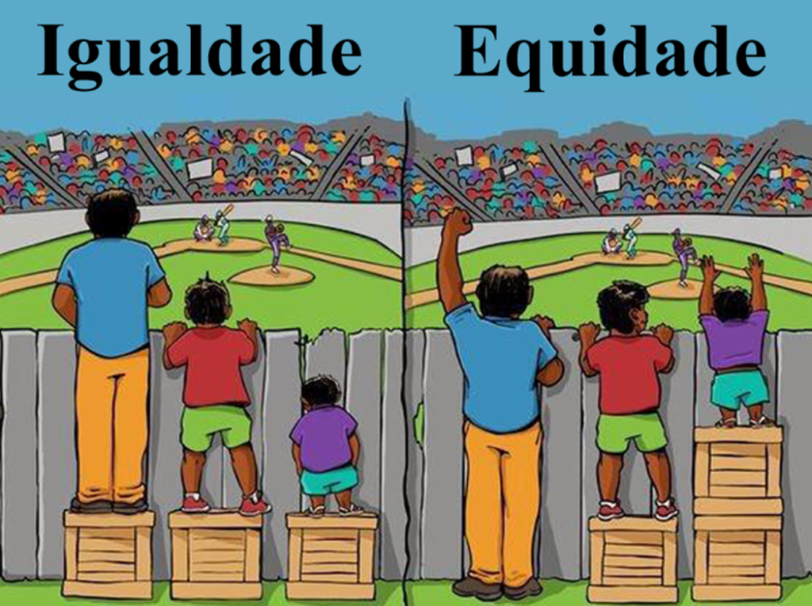

 

<b>CENTRO UNIVERSITÁRIO UNIESP</b> 
<b>Bacharelado em Direito</b> 
<b>Disciplina</b>: DIREITO CIVIL - (Parte Geral) 
<b>Professora</b>: MARIANA TAVARES 
<b>Data</b>: 29 de fevereiro de 2024, Quarta-Feira 
 
<b>Aluno</b>: Daniel Lima Claudino / 1º período 
 

<table align="right" border="0">
  <tr>
    <td align="center" valign="top">
      <a href="../../README.md">
         Início deste  Repositório
      </a>
    </td>
    <td align="center" valign="top">
      <a href="../README.md">
         Sumário da Fonte
      </a>
    </td>
    <td align="center" valign="top">
         Baixar em PDF
    </td>
  </tr>
</table>     

# Notas de Aula

## 1. Conteúdo da Aula

## Direito Civil

### Do Histórico

- A princípio, o Direito Civil Brasileiro era pautado nas normas jurídicas advindas de Portugal. Porém, em 1906 o nosso Código Civil foi positivado de acordo com o Código Napoleônico.
- Em 2002, o Brasil apresentava uma nova realidade de modo que o **Novo Código Civil** foi positivado e, depois do período de um ano de _vacatio legis_, deu-se a utilização do **Novo Código Civil** na sociedade brasileira.
  
### Das Pessoas Naturais

- **Conceito**: Esse conceito se refere a todos aqueles seres humanos que são concebidos ou que venham a nascer com possibilidade de desenvolvimento;
  - **Observação**: Não há no Direito brasilerio um concenso sobre quando se inicia a **personalidade civil da pessoa natural**.
    - **Teorias Existentes**:
      - Teoria Natalista
      - Teoria Conceptualista
- O art. 5º da Constituição Federal trata dos Direitos Fundamentais;

#### Emancipação

- A emancipação evoca o adiantamento da maior idade, a partir dos 16 anos, com efeitos _ex nunc_

### Das Pessoas Jurídicas

- São **instituições** públicas ou privadas que integram o funcionamento da sociedade;

## 2. Tópicos a serem abordados na próxima aula

## 3. Anotações Relevantes Feitas Durante a Aula

- Iniciaremos a compreensão de Direitos Humanos de 1º Geração;

### Citações

- **Citação**: "A luta pelo direito é a vida do Direito. E no dia que o Direito desistir da luta, não mais restará Direito."
  - Rudolf Von Ihering
- **Citação:** "O Direito tem que ser medido como uma **progressão aritmética**"
  - Ronald Dworkin
- **Citação**: "Quando todos os ramos do Direito falham, é o Direito Penal que acaba chegando para resolver a situação";
  - Professora
- **Citação**: "No Brasil, o Direito acaba sendo sempre um possibilidade. Ele nunca é uma certeza absoluta.";
  - Professora

### Definições e Conceitos

#### Diferença entre Efeitos Jur _ex tunc_ e _ex nunc_

- **Efeitos _ex tunc_**: Referem-se a efeitos jurídicos que retroagem e passa a produzir efeitos desde um ponto do passado para o futuro;
- **Efeitos _ex nunc_**: Referem-se a efeitos jurídicos que são do presente para o futuro, sem retroação;

#### Equidade

- Equidade significa dar às pessoas o que elas precisam para que todos tenham acesso às mesmas oportunidades. Por exemplo, em um pronto-socorro, a vítima de acidente grave passa à frente de quem necessita de um atendimento menos urgente, mesmo que esta pessoa tenha chegado mais cedo ao hospital
  - Fonte: [TJDFT](https://www.tjdft.jus.br/acessibilidade/publicacoes/sementes-da-equidade/diferenca-entre-igualdade-e-equidade#:~:text=Equidade%20significa%20dar%20%C3%A0s%20pessoas,chegado%20mais%20cedo%20ao%20hospital).

## 4. Avisos / Observações

## 5. Atividade para Próxima Aula

- Assistir ao filme [Holocausto brasileiro](<https://www.netflix.com/title/81745085>) na Netflix
  - Redigir redação relacionando os acontecimentos do filme com os direitos humanos relacionados com a **declaracao universal dos direitos humanos**;
  - Modo de apresentação: manuscrito
  - Vale: 1,0 ponto.

## 6. Referências Bibliográficas
