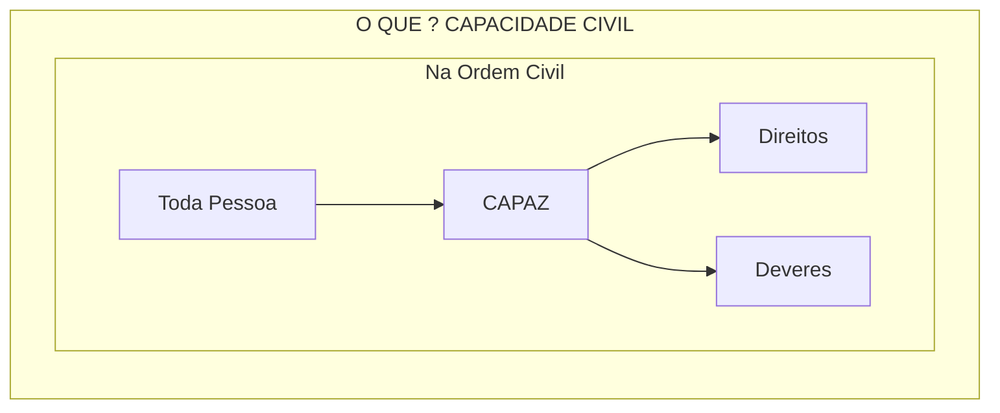
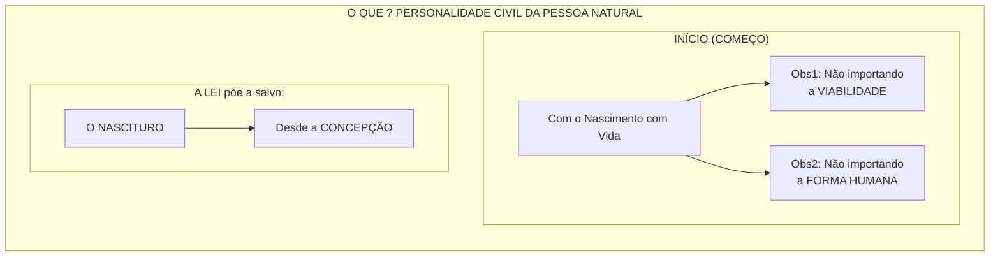
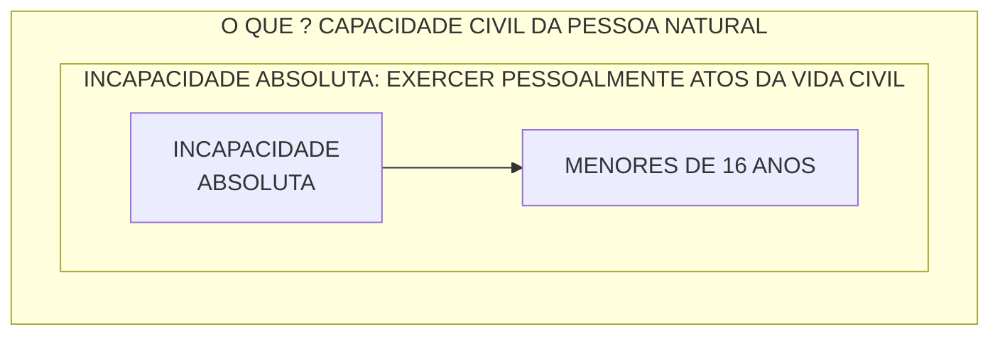
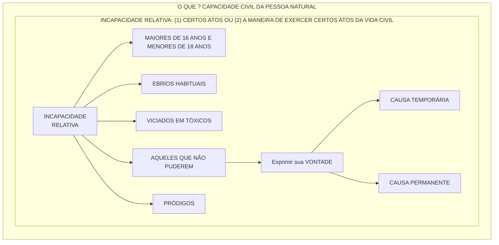
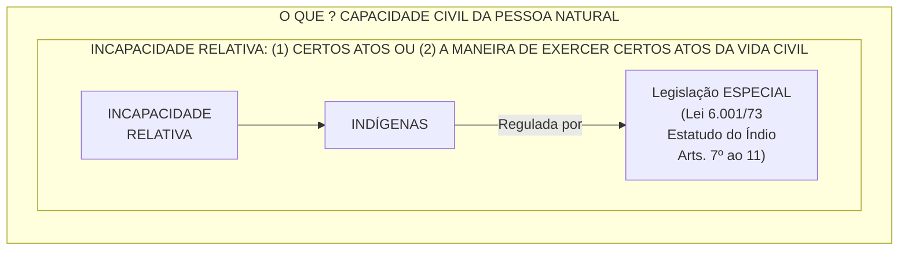
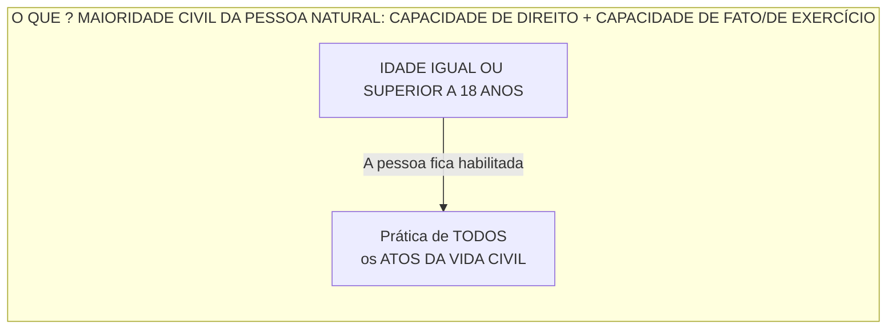
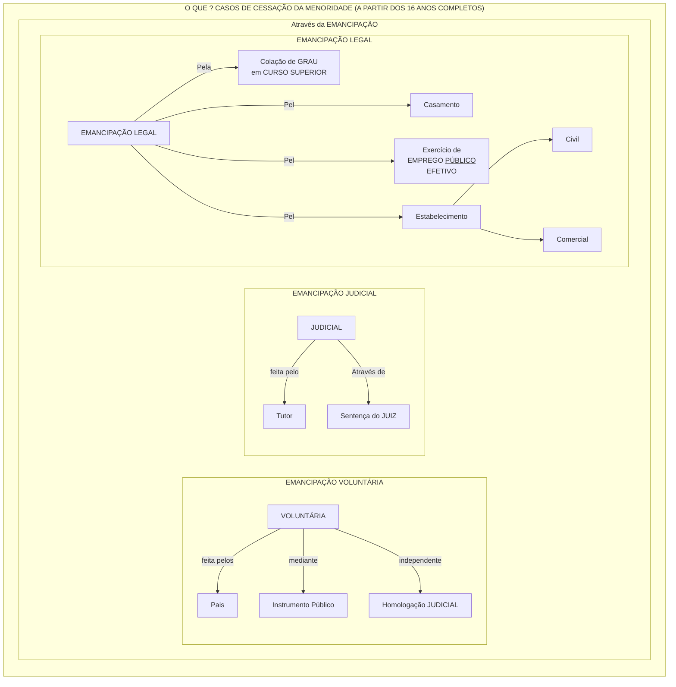

 

<b>CENTRO UNIVERSITÁRIO UNIESP</b> 
<b>Bacharelado em Direito</b> 
<b>Disciplina</b>: DIREITO CIVIL - (Parte Geral) 
<b>Professora</b>: MARIANA TAVARES 
<b>Data</b>: 04 de abril de 2024, Quinta-Feira 
 
<b>Aluno</b>: Daniel Lima Claudino / 1º período 
 

<table align="right" border="0">
  <tr>
    <td align="center" valign="top">
      <a href="../../../README.md">
         Início deste  Repositório
      </a>
    </td>
    <td align="center" valign="top">
      <a href="../README.md">
         Sumário da Fonte
      </a>
    </td>
    <td align="center" valign="top">
         Baixar em PDF
    </td>
  </tr>
</table>     

# Resumo da Lei 10.406/2002

## PARTE GERAL

## LIVRO I - DAS PESSOAS

## TÍTULO I - DAS PESSOAS NATURAIS

### CAPÍTULO I - DA PERSONALIDADE E DA CAPACIDADE

#### Artigo 1º

#### Artigo 2º

#### Artigo 3º

#### Artigo 4º

#### Artigo 5º

### CAPÍTULO II - DOS DIREITOS DA PERSONALIDADE

### CAPÍTULO III - DA AUSÊNCIA

### Seção I - Da Curadoria dos Bens do Ausente

### Seção II - Da Sucessão Provisória

### Seção III - Da Sucessão Definitiva

## TÍTULO II - DAS PESSOAS JURÍDICAS

### CAPÍTULO I - DISPOSIÇÕES GERAIS

### CAPÍTULO II - DAS ASSOCIAÇÕES

### CAPÍTULO III - DAS FUNDAÇÕES

## TÍTULO III - Do Domicílio

## LIVRO II - DOS BENS

## TÍTULO ÚNICO - DAS DIFERENTES CLASSES DE BENS

### CAPÍTULO I - DOS BENS CONSIDERADOS EM SI MESMOS

#### Seção I - Dos Bens Imóveis

#### Seção II - Dos Bens Móveis

#### Seção III - Dos Bens Fungíveis e Consumíveis

#### Seção IV - Dos Bens Divisíveis

#### Seção V - Dos Bens Singulares e Coletivos

### CAPÍTULO II - DOS BENS RECIPROCAMENTE CONSIDERADOS

### CAPÍTULO III - DOS BENS PÚBLICOS

## LIVRO III - DOS FATOS JURÍDICOS

## TÍTULO I - DO NEGÓCIO JURÍDICO

### CAPÍTULO I - DISPOSIÇÕES GERAIS

### CAPÍTULO II - DA REPRESENTAÇÃO

### CAPÍTULO III - DA CONDIÇÃO, DO TERMO E DO ENCARGO

### CAPÍTULO IV - DOS DEFEITOS DO NEGÓCIO JURÍDICO

#### Seção I - Do Erro ou Ignorância

#### Seção II - Do Dolo

#### Seção III - Da Coação

#### Seção IV - Do Estado de Perigo

#### Seção V - Da Lesão

#### Seção VI - Da Fraude Contra Credores

### CAPÍTULO V - DA INVALIDADE DO NEGÓCIO JURÍDICO

## TÍTULO II - DOS ATOS JURÍDICOS LÍCITOS

## TÍTULO III - DOS ATOS ILÍCITOS

## TÍTULO IV - DA PRESCRIÇÃO E DA DECADÊNCIA

## CAPÍTULO I - DA PRESCRIÇÃO

#### Seção I - Disposições Gerais

#### Seção II - Das Causas que Impedem ou Suspendem a Prescrição

#### Seção III - Das Causas que Interrompem a Prescrição

#### Seção IV - Dos Prazos da Prescrição

## CAPÍTULO II - DA DECADÊNCIA

## TÍTULO V - DA PROVA 