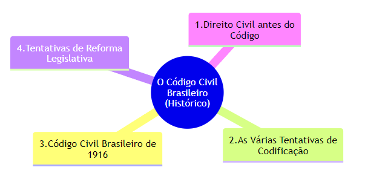

 

<b>CENTRO UNIVERSITÁRIO UNIESP</b> 
<b>Bacharelado em Direito</b> 
<b>Disciplina</b>: DIREITO CIVIL - (Parte Geral) 
<b>Professora</b>: MARIANA TAVARES 
<b>Data</b>: 10 de abril de 2024, Quarta-Feira 
 
<b>Aluno</b>: Daniel Lima Claudino / 1º período 
 

<table align="center" border="0">
  <tr>
    <td align="center" valign="top">
      <a href="../../../README.md">
         Início deste  Repositório
      </a>
    </td>
    <td align="center" valign="top">
      <a href="../README.md">
         Sumário da Fonte
      </a>
    </td>
    <td align="center" valign="top">
         Baixar em PDF
    </td>
  </tr>
</table>

# RESUMO DO CAPÍTULO 7 - O DIREITO CIVIL BRASILEIRO

## Referência Bibliográfica

VENOSA, Silvio de Salvo. [Direito Civil: Parte Geral](https://drive.google.com/file/d/1yhR20FsPBLz2i3xDgKPWcJiFUVnTLv0S/view?usp=drive_link). 23. ed. Barueri[SP]-Atlas, 2023. cap. 7

## Mapa Mental

## 1. Direito Civil antes do Código

O Direito Civil brasileiro tem suas raízes na legislação portuguesa, refletindo mais de três séculos de colonização. A influência das Ordenações do Reino, especialmente as Afonsinas (1446), Manuelinas (1521) e Filipinas (1603), é significativa. As Ordenações Filipinas, em particular, foram aplicadas no Brasil até a promulgação do Código Civil de 1916.

A independência do Brasil em 1824 resultou na recepção das Ordenações Filipinas como direito positivo, mantidas até que fosse possível criar um código civil brasileiro. Durante o Império, esforços foram feitos para codificar o direito civil, destacando-se a Consolidação das Leis Civis por Teixeira de Freitas em 1855, que não se concretizou em um código, mas influenciou significativamente o direito privado, incluindo o subsequente Código Civil argentino.

## 2. As Várias Tentativas de Codificação

Desde a primeira constituição brasileira, houve a intenção de codificar o direito civil. Teixeira de Freitas iniciou um esboço para o código em 1865, mas renunciou em 1866 devido a desacordos sobre a integração com o Código Comercial e a abrangência do direito privado. Após várias tentativas falhas por diferentes juristas, como Nabuco de Araújo e Joaquim Felício dos Santos, o projeto só tomou forma definitiva com Clóvis Beviláqua no final do século XIX.

Beviláqua finalizou o projeto do Código Civil em 1899, que após intensas revisões e debates, especialmente no Senado liderado por Rui Barbosa, foi promulgado em 1916. Este código foi pioneiro, embora fosse considerado anacrônico em face das rápidas mudanças sociais e legais do século XX.

## 3. Código Civil Brasileiro de 1916

O Código Civil de 1916 é reconhecido por sua técnica jurídica e originalidade, não se limitando a copiar modelos existentes. Incorporou conceitos modernos para a época, como a parte geral que regulava noções e relações jurídicas básicas, seguida por partes especializadas em direito de família, das coisas, das obrigações e das sucessões. Apesar de seus méritos, o código rapidamente se tornou obsoleto devido a não prever as transformações sociais significativas, como a evolução do status da mulher e mudanças na estrutura familiar.

## 4. Tentativas de Reforma Legislativa

O Código Civil de 1916 enfrentou críticas por não acompanhar as evoluções sociais e legais, levando a numerosas "leis extravagantes" que ou complementavam ou derogavam suas disposições. A partir da década de 1940, várias tentativas de reforma foram propostas, culminando com o Anteprojeto de 1972, sob a supervisão de Miguel Reale. Esse projeto evoluiu para o novo Código Civil, promulgado em 2002 após extensas modificações e debates legislativos.

O novo código tentou integrar diversos microssistemas legais e responder às mudanças sociais, mas mesmo após sua promulgação, muitas das suas disposições foram criticadas como ultrapassadas, especialmente no que tange ao direito de família, mostrando a dificuldade de um código abarcar a complexidade e dinamismo do direito privado moderno.

Esses resumos ilustram a complexidade e a evolução do Direito Civil Brasileiro, desde suas origens coloniais até as reformas do século XXI, destacando as dificuldades e desafios na criação de legislações que acompanhem as transformações sociais e culturais.