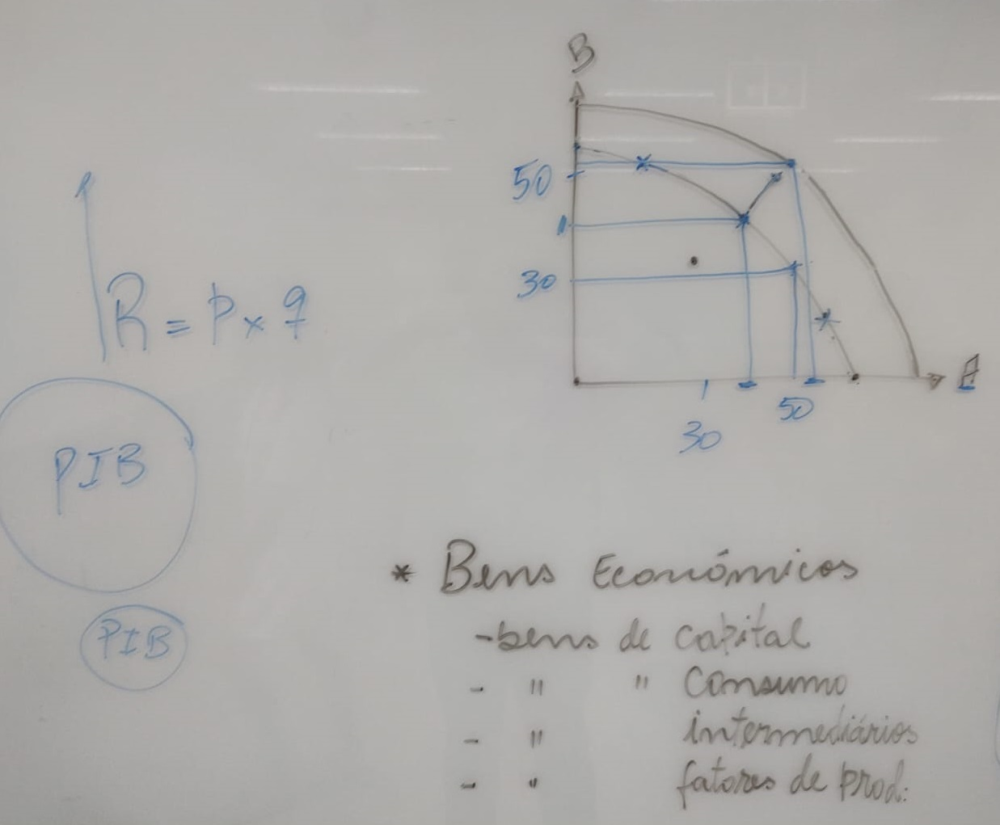
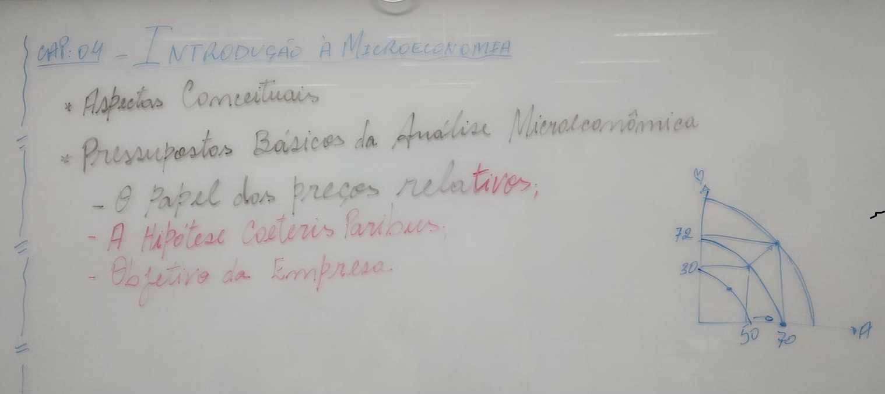

 

<b>CENTRO UNIVERSITÁRIO UNIESP</b> 
<b>Bacharelado em Direito</b> 
<b>Disciplina</b>: Economia 
<b>Professor</b>: ODILON CARREIRO DE ALMEIDA NETO 
<b>Data</b>: 06 de março de 2024, Quarta-Feira 
 
<b>Aluno</b>: Daniel Lima Claudino / 1º período 
 

# Notas de Aula da Disciplina de Economia

## 1. Conteúdo da Aula

### Final do capítulo 01

## 2. Tópicos a serem abordados na próxima aula

### Início do Capítulo 04

## 3. Anotações Relevantes Feitas Durante a Aula

- Nenhuma, nesta data 🗓.

## 4. Avisos / Observações

- Próxima aula, dia 13/03/2024, o professor iniciará o Capítulo 04 do livro recomendado;
- Após isso, será disponibilizada uma atividade valendo 2,00 pontos para somar com a nota da prova;

## 5. Material Disponibilizado no Site IESP.Edu.br

- Nenhum material disponibilizado, para esta data 🗓.

## 6. Referências Bibliográficas

- Nenhuma, nesta data 🗓.
