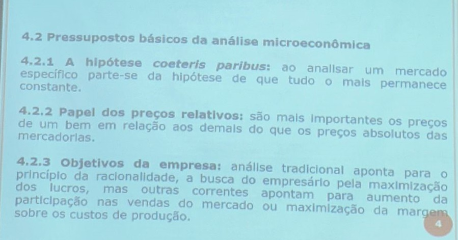
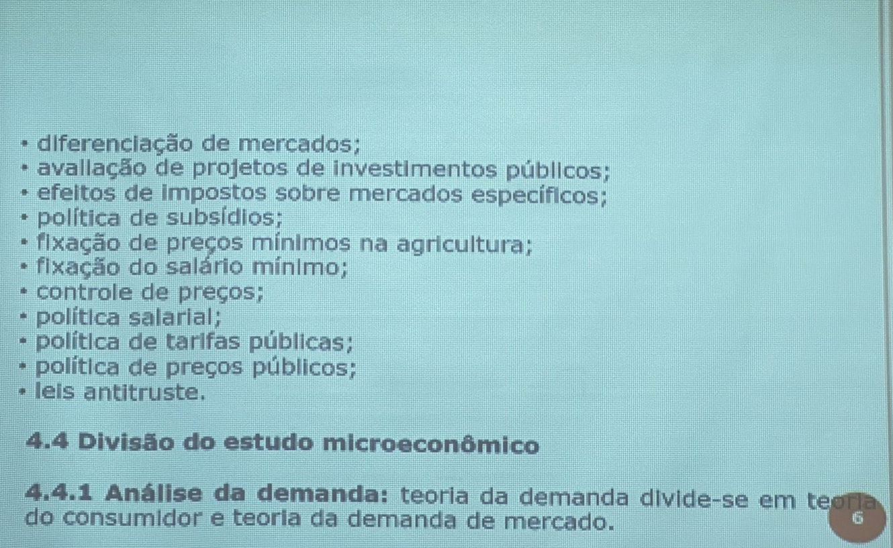
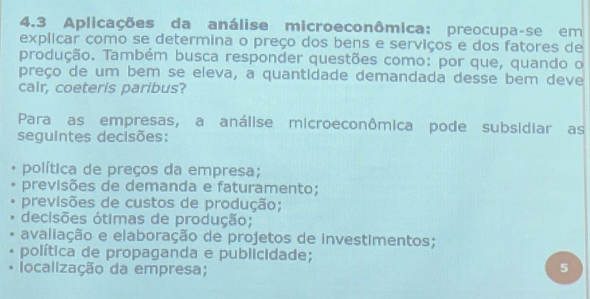

 

<b>CENTRO UNIVERSITÁRIO UNIESP</b> 
<b>Bacharelado em Direito</b> 
<b>Disciplina</b>: Economia 
<b>Professor</b>: ODILON CARREIRO DE ALMEIDA NETO 
<b>Data</b>: 13 de março de 2024, Quarta-Feira 
 
<b>Aluno</b>: Daniel Lima Claudino / 1º período 
 

# Notas de Aula da Disciplina de Economia

## 1. Conteúdo da Aula

### Foto do quadro 01

### Foto do quadro 02

### Foto do quadro 03

## 2. Tópicos a serem abordados na próxima aula

### Início do Capítulo 04

- Não pude comparecer a aula, nesta data 🗓.

## 3. Anotações Relevantes Feitas Durante a Aula

- Não pude comparecer a aula, nesta data 🗓.

## 4. Avisos / Observações

- Não pude comparecer a aula, nesta data 🗓.

## 5. Material Disponibilizado no Site IESP.Edu.br

- Não pude comparecer a aula, nesta data 🗓.

## 6. Atividades / Trabalhos em Sala (Valendo Nota)

- Nas [Notas de Aula de 06/03/2024](./notas-de-aula-2024-03-06.md), no item "4. Avisos / Observações", o professor mencionou sobre uma atividade valendo 2,00 pontos;
- Ocorreu essa atividade ?

## 7. Referências Bibliográficas

- Nenhuma, nesta data 🗓.
