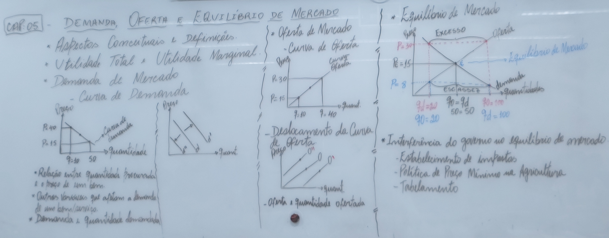
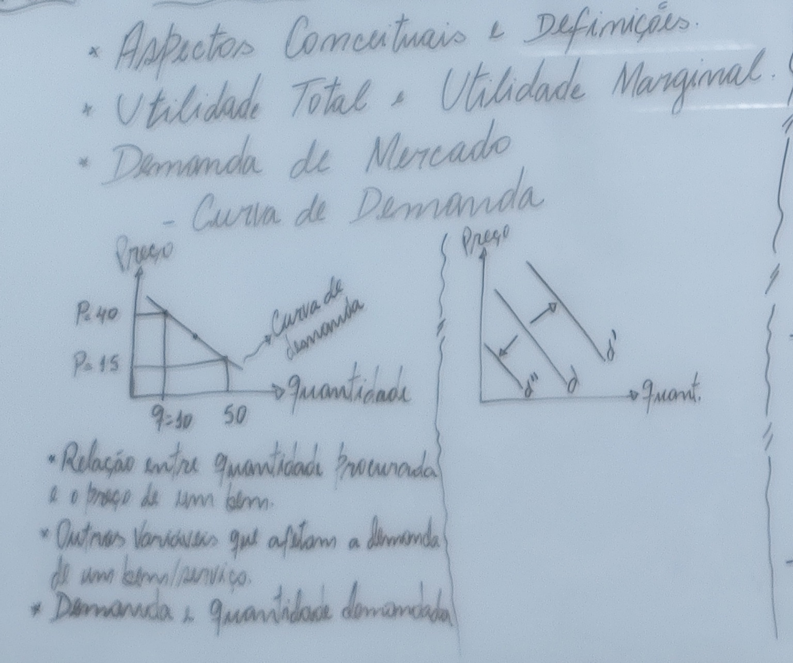
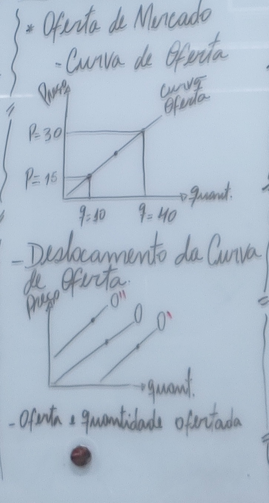

 

<b>CENTRO UNIVERSITÁRIO UNIESP</b> 
<b>Bacharelado em Direito</b> 
<b>Disciplina</b>: Economia 
<b>Professor</b>: ODILON CARREIRO DE ALMEIDA NETO 
<b>Data</b>: 20 de março de 2024, Quarta-Feira 
 
<b>Aluno</b>: Daniel Lima Claudino / 1º período 
 

<table align="right" border="0">
  <tr>
    <td align="center" valign="top">
      <a href="../../../README.md">
         Início deste  Repositório
      </a>
    </td>
    <td align="center" valign="top">
      <a href="../README.md">
         Sumário da Fonte
      </a>
    </td>
    <td align="center" valign="top">
         Baixar em PDF
    </td>
  </tr>
</table>     

# Notas de Aula da Disciplina de Economia

## 1. Conteúdo da Aula

- O professor fez as seguintes anotações no **quadro**:

### Quadro Visão Geral

### Quadro 1 de 3

### Quadro 2 de 3

### Quadro 3 de 3

## 2. Tópicos a serem abordados na próxima aula

- Ele chegou a citar, mas não entendi 🤨.

## 3. Anotações Relevantes Feitas Durante a Aula

- Três **CARACTERÍSTICAS**:
  - Da **CURVA DA DEMANDA**:
    - As grandezas **preço** e **quantidades demandadas** são **INVERSAMENTE PROPORCIONAIS**;
    - A curva é **NEGATIVAMENTE INCLINADA**
    - A curva é **DESCENDENTE**;
  - Da **CURVA DA OFERTA**:
    - As grandezas **preço** e **quantidades demandadas** são **DIRETAMENTE PROPORCIONAIS**;
    - A curva é **POSITIVAMENTE INCLINADA**
    - A curva é **ASCENDENTE**;

## 4. Avisos / Observações

- Nenhum, nesta data 🗓.

## 5. Material Disponibilizado no Site IESP.Edu.br

- Nenhum, nesta data 🗓.

## 6. Atividades / Trabalhos em Sala (Valendo Nota)

- Nenhuma, nesta data 🗓.

## 7. Referências Bibliográficas

- Nenhuma, nesta data 🗓.
