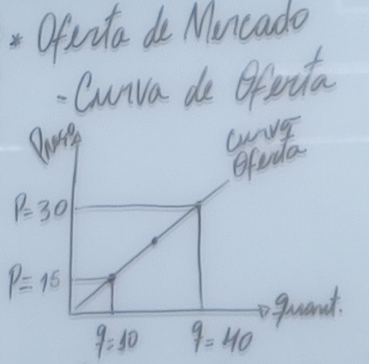
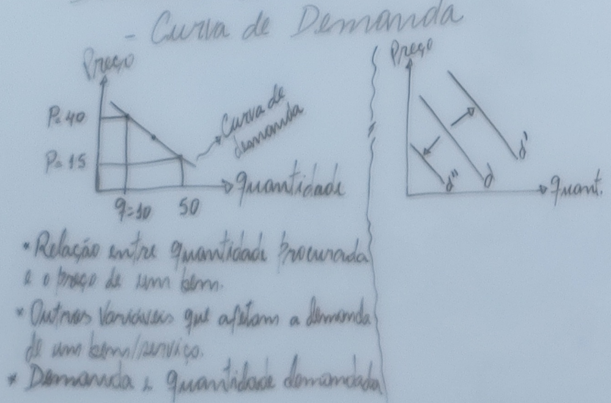
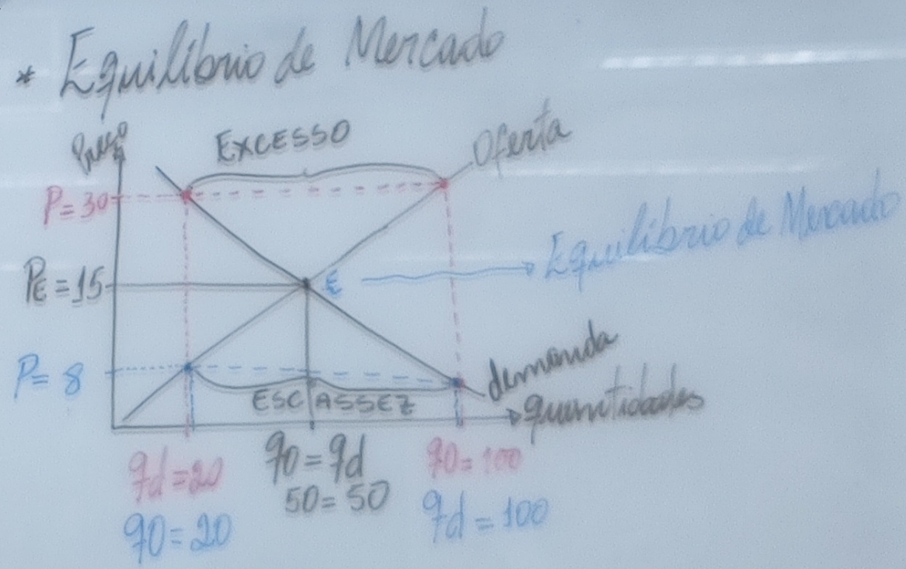

 

<b>CENTRO UNIVERSITÁRIO UNIESP</b> 
<b>Bacharelado em Direito</b> 
<b>Disciplina</b>: Economia 
<b>Professor</b>: ODILON CARREIRO DE ALMEIDA NETO 
<b>Data</b>: 27 de março de 2024, Quarta-Feira 
<b>Turno:</b> MATUTINO / 1º período 
<b>Matrícula:</b> 2024110230057 <b>Aluno:</b>Daniel Lima Claudino 
 
 

<table align="right" border="0">
  <tr>
    <td align="center" valign="top">
      <a href="../../../README.md">
         Início deste  Repositório
      </a>
    </td>
    <td align="center" valign="top">
      <a href="../README.md">
         Sumário da Fonte
      </a>
    </td>
    <td align="center" valign="top">
         Baixar em PDF
    </td>
  </tr>
</table>      

|Matrícula|Aluno|
|:---:|:---:|
|Matrícula 2024110230057|Daniel Lima Claudino|

# Atividade da Disciplina de Economia

## 1. Qual o seu entendimento da economia enquanto ciência?

#### Resposta:
- De acordo com **Vasconcelos e Garcia (2012, p. 2)**[^VASCONCELOS-GARCIA-2012], a Economia é uma ciência social que estuda como o indivíduo e a sociedade decidem (escolhem) empregar recursos produtivos escassos na produção de bens e serviços, de modo a distribuí-los entre as várias pessoas e grupos da sociedade, a fim de satisfazer as necessidades humanas;
- Nosso cotidiano está repleto de situações em que nos deparamos com as chamadas **questões econômicas**:
  - Aumento de preços;
  - Desemprego;
  - Deficit governamental;
  - Impostos;
  - Inflação;
  - Ociosidade de alguns setores de atividade
  - Dentre inúmeros outros;
- É alguns casos, em que precisamos tomar decisões importantes e, principalmente sermos responsabilizados por elas, precisamos de **conhecimentos teóricos** para podermos melhor analisar **as questões econômicas** e **os problemas econômicos**;
  - Seja como um empreendedor, seja como um operador do Direito; 

<table border="1" id="quadro-definicao-XXXXX">
<tr>
  <td align="center" valign="top"width="140px" style="border-right-style:hidden">
    
   <b>Objetivo do Estudo da Ciência Econômica (Economia)</b>
  </td>
  <td valign="top">

<b>O <u>OBJETIVO</u> DO ESTUDO DA CIÊNCIA ECONÔMICA</b> Por que estudar a Ciência Econômica ?

  

    Estuda-se Ciência Econômica (Economia) para:
  

     <ul>
       <li>Identificar, analisar e descrever adequadamente os <b>problemas econômicos</b>;</li>
       <li>Formularmos adequadamente <b>soluções</b> para <b>resolvê-los</b>;</li>
     </ul>
   
Isso posto, conclui-se que, um vez alcançado esses objetivos intermediários, alcançaremos o <b><u>objetivo maior do estudo da ciência econômica</u></b> que é <b>a melhora de nossa <u>qualidade de vida</u></b>
  
   </td>
</tr>
</table>

## 2. Explique como se dá o funcionamento de uma economia de mercado com os dois agentes econômicos (Empresas e Famílias)?

#### Resposta:
   Existem MODELOS que procuram representar o FUNCIONAMENTO DO SISTEMA ECONÔMICO em uma ECONOMIA DE MERCADO com os dois agentes econômicos (Empresas e Famílias);
  - Esses modelos são compostos:
    - De ELEMENTOS;
    - De RELACIONAMENTO ENTRE ELEMENTOS; e
    - Do FLUXO que orientará a LEITURA DO MODELO;
  - Três **modelos** são apresentados
    - (1) FLUXO CIRCULAR DE RENDA ou FLUXO CIRCULAR DA RIQUEZA
      - (2)FLUXO REAL DA ECONOMIA
        - Só é possível através do DINHEIRO/MOEDA;
          - Utilizada para remunerar os FATORES DE PRODUÇÃO e para o PAGAMENTO DE BENS E SERVIÇOS;
        - Em razão disso, torna-se necessário o FLUXO MONETÁRIO para completar a visão do FLUXO CIRCULAR DE RENDA ou FLUXO CIRCULAR DA RIQUEZA;
      - (2) FLUXO MONETÁRIO DA ECONOMIA

<b>Figura</b>: FLUXO CIRCULAR DE RENDA ou FLUXO CIRCULAR DA RIQUEZA = Fluxo monetário + Fluxo Real

## 3. O que representa a curva de possibilidade de produção de uma empresa? 

#### Resposta:
- Devido a **ESCASSEZ** de **RECURSOS**, a **PRODUÇÃO TOTAL** de um país tem um **LIMITE MÁXIMO**;
  - Esse **LIMITE DE PRODUÇÃO MÁXIMO**, onde **<u>todos os recursos</u> são empregados**, onde **<u>todos os trabalhadores que querem trabalhar</u> estão empregados** e **não há capacidade ociosa**:
    - Também é chamado:
    - PRODUÇÃO POTENCIAL;
    - PRODUTO DE PLENO EMPREGO

- Para relacionar a CAPACIDADE TOTAL DE PRODUÇÃO com a PRODUÇÃO DE BENS NA SOCIEDADE foi idealizada a **Curva de Possibilidades de Produção (CPP ou Curva de Transformação)**

<table border="1" id="quadro-conceito-cpp">
<tr>
  <td align="center" valign="top"width="140px" style="border-right-style:hidden">
    
   <b>Duvida ?</b>
  </td>
  <td valign="top">

<b>O QUE É Curva de Possibilidades de Produção (CPP ou Curva de Transformação) ?</b>

  

    É um <b>conceito teórico</b> com o qual <b>se ilustra:
  

   <ul>
     <li>COMO a QUESTÃO DA ESCASSEZ impõe um LIMITE à CAPACIDADE DE PRODUÇÃO de uma sociedade, que terá de fazer ESCOLHAS entre as ALTERNATIVAS DE PRODUÇÃO</li>
     </ul>
   </ul>
   </td>
</tr>
</table>

## 4. O que é o custo de oportunidade?

#### Resposta:
- Considere a **transferência de FATORES DE PRODUÇÃO**, inicialmente alocados para produção de um bem A, para um bem B:
  - Isso **IMPLICA** em um **CUSTO DE OPORTUNIDADE** (OBJETO DA PERGUNTA);
  - Que **REPRESENTA** o **CUSTO DA PRODUÇÃO ALTERNATIVA SACRIFICADA**;
  - **IMPLICANDO** em um **GRAU DE DIFICULTADADE** cada vez mais **ACENTUADO** e **ONEROSO**;
    - Esse fato **IMPLICA** no **FORMATO DA CURVA (CPP)** ser **CÔNCAVA**;
    - **Acréscimos IGUAIS** na **produção de um B** ACARRETARÁ em **acréscimos CADA VEZ MAIORES** no **CUSTO DE OPORTUNIDADE da produção do bem A**;
- O **CUSTO DE OPORTUNIDADE** também é chamado de:
  - **CUSTO ALTERNATIVO**
  - **CUSTO IMPLÍCITO**
- É característico, a partir da **CURVA DE POSSIBILIDADE DE PRODUÇÃO (CPP)**, que o **CUSTO DE OPORTUNIDADE** seja **CRESCENTE**;

## 5. Que papel os preços relativos exercem na análise microeconômica?

#### Resposta:
- Segundo Vasconcelos e Garcia (2012, p. 31), os **preços relativos** são os preços de um bem em relação aos demais (bens) que na análise microeconômica, são mais relevantes que os **preços absolutos**;
- A **importancia dos preços relativos na análise microeconômica** é fundamental, haja vista que **os agentes econômicos escolhem com base na diferença de preços dos bens** (os preços relativos entre os diferentes bens e serviços) e não nos absolutos.

## 6. Um estabelecimento comercial pode ser considerado de duas formas: a econômica e a jurídica.  Explique cada uma delas. 

#### Resposta:

- Ambas as perspectivas são complementares e essenciais para o sucesso e a viabilidade de um estabelecimento comercial;
- A **forma econômica** enfoca a eficácia e eficiência das operações comerciais, buscando gerar valor e satisfação para os clientes e demais partes interessadas.
- Já a **forma jurídica** assegura que tais operações estejam alinhadas com as exigências legais e normativas, promovendo um ambiente de negócios justo e transparente. A interação entre essas duas formas permite que um estabelecimento comercial não apenas prospere economicamente, mas também contribua positivamente para a sociedade dentro referenciais sociais, econômicos, éticos e legais.

## 7. Na análise microeconômica de mercado, qual a relevância da hipótese do coeteris paribus?

#### Resposta:
- A expressão latina "_coeteribus paribus_" significa "tudo mais permanece constante";
- Para realizar análises econômicas precisamos partir de um modelo da forma mais simples possível, dando foco àquele mercado, analisando-se o papel que a oferta e a demanda nele exercem, supondo-se que outras variáveis (1) interferiram muito pouco ou (2) que não interferiram de maneira absoluta.

## 8. O estudo da microeconomia se divide em quatro pontos fundamentais.  Quais são eles e descreva um pouco sobre os mesmos. 

## 9. Como se divide o estudo da microeconomia?

#### Resposta:
- O estudo da microeconomia se divide em (VASCONCELOS; GARCIA, 2012, p. 33-34)
  - Análise da Demanda
  - Análise da oferta;
  - Análise das estruturas de Mercado;
  - Teoria do Equilíbrio Geral;

## 9. ANULADA (Ver abaixo)

## 10. Destaque quatro principais campos de atuação do estudo da microeconomia?

#### Resposta:
- São campos de atuação do estudo da microeconomia (VASCONCELOS; GARCIA, 2012, p. 33):
  - No nível das Empresas:
    - Política de preços da empresa;
    - Provisões de demanda e faturamento
  - No nível de Políticas Econômicas
    - Efeito de impostos sobre mercados específicos
    - Política de subsídios

## 11. Descreva com suas palavras: (demanda; oferta) de mercado.

#### Resposta:
- No capítulo 5 do livro Introdução à Economia, Vasconcelos e Garcia (2012, p. 37) apresentam os conceitos de demanda e oferta;
- Em minhas próprias palavras, assim os compreendo:
  - Demanda:
    - É o comportamento das famílias numa economia de mercado;
    - É a quantidade desejada e procurada pelas famílias (consumidores) num determinado período de tempo;
  - Oferta:
    - É o comportamento das empresas numa economia de mercado;
    - É a quantidade **ofertada** pelas empresas, considerando os fatores de produção disponíveis num determinado período de tempo;

## 12. Represente graficamente o comportamento da curva de Oferta de mercado e como se dá o seu funcionamento. 

#### Resposta:
- A curva de oferta de mercado, representada graficamente, é ascendente, indicando que à medida que o preço de um bem ou serviço aumenta, a quantidade oferecida desse bem ou serviço pelos produtores também aumenta. Esse comportamento reflete a relação direta entre preço e quantidade oferecida: produtores estão dispostos a fornecer mais de um produto quando o preço é mais alto, pois isso potencialmente aumenta a receita;

<b>Figura</b>: Comportamento da curva de Oferta de mercado

- Em resumo, conforme citado em sala de aula pelo professor: Existem três **CARACTERÍSTICAS** da **CURVA DA OFERTA**:
    - As grandezas **preço** e **quantidades demandadas** são **DIRETAMENTE PROPORCIONAIS**;
    - A curva é **POSITIVAMENTE INCLINADA**
    - A curva é **ASCENDENTE**;

## 13. Represente graficamente a curva de demanda de mercado e explique como se dá o seu funcionamento. 

#### Resposta:
- A curva de demanda de mercado demonstra a relação inversa entre o preço de um bem e a quantidade demandada desse bem. Graficamente, é representada por uma linha descendente da esquerda para a direita, indicando que, à medida que o preço diminui, a quantidade demandada aumenta, e vice-versa. Esse comportamento reflete a lei da demanda, fundamentada na capacidade e disposição dos consumidores em comprar mais de um bem a preços mais baixos e menos a preços mais altos.

<b>Figura</b>: Comportamento da curva de Oferta de mercado

- Em resumo, conforme citado em sala de aula pelo professor: Existem três **CARACTERÍSTICAS** da **CURVA DA DEMANDA**:
    - As grandezas **preço** e **quantidades demandadas** são **INVERSAMENTE PROPORCIONAIS**;
    - A curva é **NEGATIVAMENTE INCLINADA**
    - A curva é **DESCENDENTE**;

## 14. Como eliminar um excesso de oferta de mercado para fazer com que esse mercado volte ao ponto de equilíbrio?

#### Resposta:

- Conforme aula do dia 20/03/2024, através da análise de equilíbrio de mercado, podemos empreender esforços no sentido de eliminar um excesso de oferta através da seguinte conduta:
  - Diminuindo o preço do produto ou serviço;

<b>Figura</b>: Equilíbrio de Mercado

## 15. Como fazer para eliminar uma escassez de mercado para fazer com que esse mercado volte ao ponto de equilíbrio?

#### Resposta:

- Conforme aula do dia 20/03/2024, através da análise de equilíbrio de mercado, podemos empreender esforços no sentido de eliminar uma escassez fazendo da seguinte conduta:
  - Aumentar o preço do bem ou serviço;

<b>Figura</b>: Equilíbrio de Mercado

## 16. Elabore uma pergunta e responda

#### Resposta:

- **PERGUNTA**: Cite apenas três aplicações dos conhecimentos da Ciência economica em relação à Ciência do Direito.
- **RESPOSTA**:
  - **Regulação econômica**: Aplicação de princípios econômicos para criar, interpretar e aplicar leis que promovem a concorrência e limitam práticas monopolistas.
  - **Direito tributário**: Uso da teoria econômica para desenvolver sistemas de tributação eficientes e justos, influenciando a elaboração de políticas fiscais
  - **Análise econômica do direito**: Emprego de métodos econômicos para avaliar as consequências legais e a eficácia das leis, visando otimizar resultados sociais e econômicos.

## Questão Anulada Pelo Professor

### 8. O estudo da microeconomia se divide em quatro pontos fundamentais.  Quais são eles e descreva um pouco sobre os mesmos. 

### 9. Como se divide o estudo da microeconomia?

#### Resposta:
- A microeconomia é uma ramo da economia que analisa o comportamento de indivíduos e empresas para compreender como as decisões são tomadas no âmbito dos recursos limitados.
- Seu estudo se divide em quatro pontos fundamentais:
  - **Teoria do Consumidor**: Examina como os consumidores tomam decisões para alocar seus recursos entre os diferentes bens e serviços disponíveis. Isso inclui a análise da utilidade, preferências e demanda.
  - **Teoria da Firma**: Foca nas empresas e como elas tomam decisões sobre produção, preços, e quantidades a serem ofertadas no mercado. Inclui a análise dos custos de produção e maximização de lucros.
  - **Teoria dos Mercados e Preços**: Analisa como os preços e quantidades de bens e serviços são determinados em diferentes tipos de mercados (como perfeita concorrência, monopólio, concorrência monopolística e oligopólio) através da interação entre oferta e demanda.
  - **Teoria da Distribuição de Renda**: Examina como a renda é distribuída entre os proprietários dos fatores de produção, incluindo trabalho, capital e terra. Isso envolve o estudo dos salários, aluguéis, e lucros, e como estes são determinados no mercado.

## Referências Bibliográficas

[^VASCONCELOS-GARCIA-2012]: VASCONCELOS, Marcos Antônio S.;GARCIA, Manuel E. Introdução à Economia. São Paulo : Saraiva, 2012.