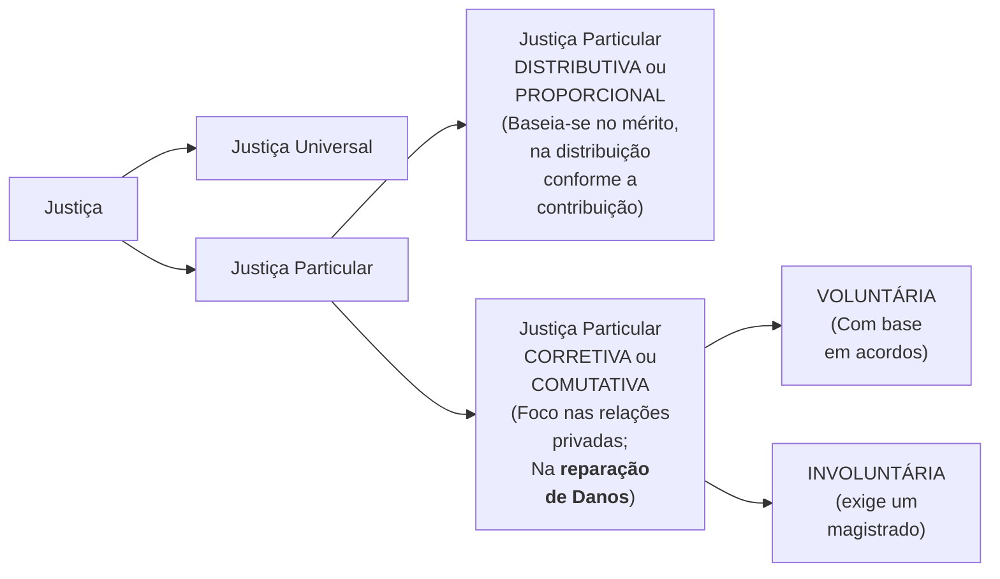

 

<b>CENTRO UNIVERSITÁRIO UNIESP</b> 
<b>Bacharelado em Direito</b> 
<b>Disciplina</b>: FILOSOFIA GERAL E JURÍDICA 
<b>Professor</b>: ODILON CARREIRO DE ALMEIDA NETO 
<b>Data</b>: 13 de março de 2024, Quarta-Feira 
 
<b>Aluno</b>: Daniel Lima Claudino / 1º período 
 

<table align="right" border="0">
  <tr>
    <td align="center" valign="top">
      <a href="../../../README.md">
         Início deste  Repositório
      </a>
    </td>
    <td align="center" valign="top">
      <a href="../README.md">
         Sumário da Fonte
      </a>
    </td>
    <td align="center" valign="top">
         Baixar em PDF
    </td>
  </tr>
</table>     

# Atividade 03 da Disciplina Filosofia Geral e Jurídica

## Resumo do Texto: "Aristóteles e a Filosofia do Direito"

Trata-se de um artigo que apresenta o estudo da equidade dentro da história do pensamento jurídico. Destaca-se no texto a contribuição de Aristóteles para a Filosofia do Direito. A autora do artigo pretendeu demonstrar a forte vinculação da **noção de equidade** com a **noção de justiça formal**.

A obra do filósofo é apontada como marco inicial da **Filosofia Jurídica**, devido a sua abordagem inovadora sobre a **justiça**, que, segundo ele, divide-se em **Justiça Universal** e **Justiça Particular**.

A **Justiça Universal** diz respeito a **um consenso amplo de justiça** que **se manifesta** nas **relações cotidianas** **dentro de um Estado**. 

A **Justiça Particular** é associada à lei, com Aristóteles defendendo a inseparabilidade entre justiça e legalidade, onde a **lei justa** é aquela que, (1) além de **formalmente elaborada**, (2) possui um **conteúdo ético** que promove a **equidade**. Ainda nesse conceito de justiça, Aristóteles faz distinção entre **Justiça Distributiva ou Proporcional** e **Justiça Corretiva ou Comutativa**. A **Justiça Distributiva** relaciona-se à distribuição justa dos bens do Estado, **baseada no mérito**, garantindo que **cada um receba o que merece conforme seu talento e contribuição**. Já a **Justiça Corretiva** foca nas **relações privadas**, tratando da **reparação de danos** em casos de prejuízo, podendo ser **voluntária**, através de **acordos**, ou **involuntária**, exigindo a intervenção de um **magistrado** para reestabelecer a justiça.

<b>Figura 1:</b> Classificação da Justiça, segundo Aristóteles

<b>Fonte:</b> Elaborado pelo autor deste resumo.

Os conceitos modernos de **Direito Público** e **Direito Privado** relacionam-se com essa categorização aristotélica de justiça. O artigo destaca, nesse sentido, a atualidade e relevância das ideias de Aristóteles no **pensamento jurídico contemporâneo**.

Pode-se também depreender-se do texto que a justiça deve ser realizada de forma a estar em conformidade com o **justo natural** e com o **justo legal**. Afirma-se ainda, nesse sentido, que o **justo natural** deve-se sobrepor ao **justo legal** o que é apontado como essencial para o **conceito de justiça**.

Conclui-se que o presente texto sobre Aristóteles e a Filosofia do Direito destaca a inovação do filósofo ao tratar da justiça, sua divisão em Universal e Particular, a importância da equidade na lei, e as noções de Justiça Distributiva e Corretiva, evidenciando como suas ideias influenciam até hoje a compreensão e aplicação do direito.