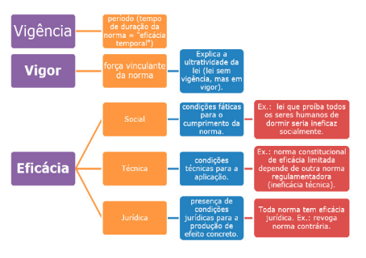

 

<b>CENTRO UNIVERSITÁRIO UNIESP</b> 
<b>Bacharelado em Direito</b> 
<b>Disciplina</b>: Teoria do Direito (Introdução ao Estudo do Direito) 
<b>Professor</b>: MARCEL 
<b>Data</b>: 18 de março de 2024, segunda-feira 
 
<b>Aluno</b>: Daniel Lima Claudino / 1º período 
 

<table align="right" border="0">
  <tr>
    <td align="center" valign="top">
      <a href="../../../README.md">
         Início deste  Repositório
      </a>
    </td>
    <td align="center" valign="top">
      <a href="../README.md">
         Sumário da Fonte
      </a>
    </td>
    <td align="center" valign="top">
         Baixar em PDF
    </td>
  </tr>
</table>     

# Notas de Aula da Disciplina Teoria do Direito

## 1. Conteúdo da Aula

### Discussão sobre o artigo
- Discussão em sala (professor/alunos) sobre o artigo [TEORIA PURA DO DIREITO E POSITIVISMO JURÍDICO: A INFLUÊNCIA DO NORMATIVISMO EM HANS KELSEN E SEUS IMPACTOS](https://drive.google.com/file/d/1-SeAowd11IKjxmpHnsNjSkY4Cfu6jdRu/view?usp=drive_link);

### Anotações no Quadro

- Três grandes filósofos do Direito
  - **Pachukanis**
    - Considerado o mais proeminente teórico marxista no campo do Direito;
    - Considerava que o Direito é uma forma burguesa que atinge o máximo de seu desenvolvimento no capitalismo e que deve ser extinta quando da superação deste modo de produção;
  - **Hans Kelsen**
    - Autor da **Teoria Pura do Direito (1934)**[^KELSEN-1998]
      - O Direito livre de **valor**
    - O Direito é compreendido a partir da **NORMA JURÍDICA**;
      - A NORMA JURÍDICA
        - Possui **CARACTERÍSTICAS**
          - Validade: 
            - É uma qualidade da norma que foi elaborada
              - Por quem legitmamente elaborá-la
              - Seguindo o procedimento formal pré-estabelecido
              - Ela NÃO CONFLITA com uma norma hierárquica superior
          - Vigência:
            - Período em que a norma entra e saí do ordenamento jurídico
          - Eficácia
            - É a qualidade da norma ter condições de produzir RESULTADOS;
        - Possui uma **ESTRUTURA**
          - Premissa MAIOR: A norma jurídica relacionada;
          - Premissa MENOR: Análise da ocorrência ou não do FATO;
          - CONSEQUÊNCIA: Sanção
  - **Carl Schmitt**
    - **Falta alguma anotação/comentário do professor sobre este pensador.**

## 2. Tópicos a serem abordados na próxima aula

- Nenhum tópico para próxima aula foi indicado, nesta data 🗓.

## 3. Anotações Relevantes Feitas Durante a Aula

- Em relação aos seguintes termos abordados em aula: **vigência** e **eficácia**:

## 4. Avisos / Observações

- Foi orientado pelo professor, após a discussão do artigo [TEORIA PURA DO DIREITO E POSITIVISMO JURÍDICO: A INFLUÊNCIA DO NORMATIVISMO EM HANS KELSEN E SEUS IMPACTOS](https://drive.google.com/file/d/1-SeAowd11IKjxmpHnsNjSkY4Cfu6jdRu/view?usp=drive_link), a leitura do material complementar do **item 5** (Material Disponibilizado no Portal do Aluno UNIESP) desta nota de aula.

## 5. Material Disponibilizado no Portal do Aluno (UNIESP)

- Para aula dedsta data foi disponibilizado o seguinte material no Site no Portal do Aluno:
  - Artigo: [TEORIA PURA DO DIREITO E POSITIVISMO JURÍDICO: A INFLUÊNCIA DO NORMATIVISMO EM HANS KELSEN E SEUS IMPACTOS](https://drive.google.com/file/d/1-SeAowd11IKjxmpHnsNjSkY4Cfu6jdRu/view?usp=drive_link);
  - Capítulo de Livro: [Hans Kelsen - Filosofia jurídica e democracia](https://drive.google.com/file/d/1-RDqmdWscUdPPHaDf2Orj3G3u8VmA8KE/view?usp=sharing)
  - Apresentação em Slides: [Teoria e Introdução ao Estudo do Direito - O que é o Direito ?](https://docs.google.com/presentation/d/1-NODeb2eqEt6dUPMpqACg-Yx711d1ezx/edit?usp=drive_link&ouid=111932077361451535905&rtpof=true&sd=true)

## 6. Atividades / Trabalhos em Sala (Valendo Nota)

- Nenhuma, nesta data 🗓.

## 7. Referências Bibliográficas

[^KELSEN-1998]: KELSEN, Hans. Teoria Pura do Direito. 6ª ed. São Paulo: Martins Fontes, 1998.
