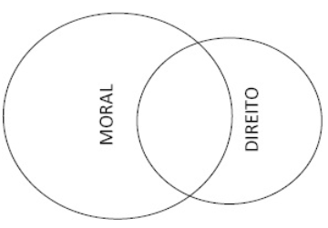

 

<b>CENTRO UNIVERSITÁRIO UNIESP</b> 
<b>Bacharelado em Direito</b> 
<b>Disciplina</b>: Teoria do Direito (Introdução ao Estudo do Direito) 
<b>Professor</b>: MARCEL 
<b>Data</b>: 25 de março de 2024, segunda-feira 
 
<b>Aluno</b>: Daniel Lima Claudino / 1º período 
 

<table align="right" border="0">
  <tr>
    <td align="center" valign="top">
      <a href="../../../README.md">
         Início deste  Repositório
      </a>
    </td>
    <td align="center" valign="top">
      <a href="../README.md">
         Sumário da Fonte
      </a>
    </td>
    <td align="center" valign="top">
         Baixar em PDF
    </td>
  </tr>
</table>     

# Notas de Aula da Disciplina Teoria do Direito

## 1. Conteúdo da Aula

### HANS KELSEN

- Lidera o movimento de **POSITIVISMO JURÍDICO** que vem sob influência do positivismo de Comte, mas frise-se que o **POSITIVISMO JURÍDICO** se percebe como um **movimento autônomo**;
- Sua **PRINCIPAL CARACTERÍSTICA** é tratar o Direito como um **FENÔMENO SOCIAL** que poderia ser <b><u>observado</u></b> e <b><u>analisado</u></b> cientificamente, tendo como **OBJETO** a **NORMA JURÍDICA**;

### CORRENTES JUSNATURALISTA

- **DIREITO NATURAL** como <b><u>elemento fundante</u></b>, baseavam-se em buscar a ideia de justiça. Logo, <b><u>o Direito apenas existe</u></b> SE e ENQUANTO revelar ou refletir o <b><u>conteúdo do justo</u></b>;

### CORRENTES JUSPOSITIVISTAS

- DIREITO POSITIVO como <b><u>elemento fundante</u></b>;
- O ORDENAMENTO JURÍDICO e suas NORMAS POSITIVADAS, revelam o Direito;
- Questionamentos:
  - O que esse ideal de justiça ?

### NEOCONSTITUCIONALISMO

- Corrente doutrinária que surgiu a partir do final da II Guerra Mundial;
- Lembrar do Tribunal de Nuremberg;
- O NEOCONSTITUCIONALISMO
  - É marcado pela positivação dos direito humanos;
  - Direitos humanos = Direitos Fundamentais
  - Direito fundamental é um direito humano que positivado no ordenamento jurídico;

### ORDENAMENTO JURÍDICO

- É o conjunto de normas positivadas;
- É formado por:
  - Normas Jurídicas
    - **Normas ESCRITAS**
      - Exemplo: leis;
    - **Normas NÃO ESCRITAS**
      - Chamadas de:
        - Regras de Calibração (normas semelhantes a termostatos)
          - Torna o Direito, um sistema autonomo responsável pela sua própria produção;

### TEORIAS SOBRE O DIREITO E A MORAL

#### Teoria dos Círculos Concêntricos

#### Teoria dos Círculos Independentes (Visão Kelseniana)

#### Teoria dos Círculos Secantes

- Inaugura o **NEOCONSTITUCIONALISMO**;
- Marcada pelo surgimento dos **DIREITOS FUNDAMENTAIS**;

#### Teoria do Mínimo Ético

- Acrescento esta última teoria para complementar as outras três trazidas pelo professor Marcel, nesta data;
- Para esta teoria, contida no **capítulo 05 (Instrumentos de Controle Social)** do livro de **Introdução ao Estudo do Direito** de **Paulo Nader**, 36.ed.:
  - **A teoria do “mínimo ético”**
    - Desenvolvida por Jellinek, a teoria do mínimo ético consiste na ideia de que o Direito representa o mínimo de preceitos morais necessários ao bem-estar da coletividade. Para o jurista alemão toda sociedade converte em Direito os axiomas morais estritamente essenciais à garantia e preservação de suas instituições. A prevalecer essa concepção o Direito estaria implantado, por inteiro, nos domínios da Moral, configurando, assim, a hipótese dos círculos concêntricos.
    - Empregamos a expressão mínimo ético para indicar que o Direito deve conter apenas o mínimo de conteúdo moral, indispensável ao equilíbrio das forças sociais, em oposição ao pensamento do máximo ético, exposto por Schmoller. Se o Direito não tem por finalidade o aperfeiçoamento do homem, mas a segurança social, não deve ser uma cópia do amplo campo da Moral; não deve preocupar-se em trasladar para os códigos todo o continente ético. Diante da vastidão do território jurídico, não se pode dizer que o mínimo ético não seja expressivo.
    - Basta que se consulte o Código Penal para certificar-se de que o mencionado bem-estar da coletividade exige uma complexidade normativa.
    - A não adoção dessa teoria, assim interpretada, implicaria a acolhida do **MÁXIMO ÉTICO**, pelo qual o Direito deveria ampliar a sua missão, para reger, de uma forma direta e mais penetrante, a problemática social;

## 2. Fotos do Quadro

### Quadro 1/1

## 3. Anotações Relevantes Feitas Durante a Aula

- **TEORIA DO MÍNIMO ÉTICO**, acrescentada na seção 1 desta nota de aula;

## 4. Avisos / Observações

- Nenhum, nesta data 🗓.

## 5. Material Disponibilizado na Área do Aluno

- Nenhum, nesta data 🗓.
- Para acessar a Seção de Arquivos da Área do Aluno: (https://portaltotvs.iesp.edu.br:60443/FrameHTML/web/app/edu/PortalEducacional/#/arquivos)

## 6. Atividades / Trabalhos em Sala (Valendo Nota)

- Nenhuma, nesta data 🗓.

## 7. Referências Bibliográficas

- Nenhuma, nesta data 🗓.
