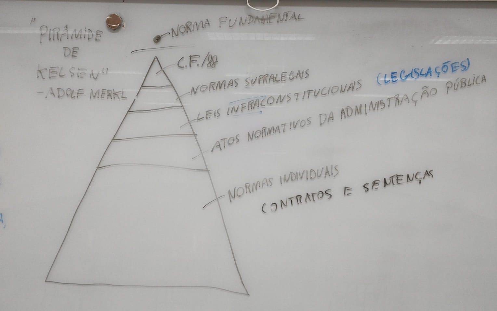

 

<b>CENTRO UNIVERSITÁRIO UNIESP</b> 
<b>Bacharelado em Direito</b> 
<b>Disciplina</b>: Teoria do Direito (Introdução ao Estudo do Direito) 
<b>Professor</b>: MARCEL 
<b>Data</b>: 01 de abril de 2024, segunda-feira 
 
<b>Aluno</b>: Daniel Lima Claudino / 1º período 
 

<table align="right" border="0">
  <tr>
    <td align="center" valign="top">
      <a href="../../README.md">
         Início deste  Repositório
      </a>
    </td>
    <td align="center" valign="top">
      <a href="../README.md">
         Sumário da Fonte
      </a>
    </td>
    <td align="center" valign="top">
         Baixar em PDF
    </td>
  </tr>
</table>     

# Notas de Aula da Disciplina Teoria do Direito

## 1. Conteúdo da Aula

### Teoria do Ordenamento Jurídico

- É o **conjunto de NORMAS JURÍDICAS** de forma **hierárquica** e **coerente**. O conjunto é **composto de regras** que formam um "**vocabulário normativo**", bem como por **instrumentos de calibração** que revelam **como o conjunto funciona**.
- Dessa maneira este sistema **tem a capacidade de manter-se funcional** perante a sociedade que regulamenta, sendo **autônomo**, mas **socialmente** e **politicamente** conectado;

### Normas Supralegais

- São as **NORMAS** que tratam sobre **Direitos Humanos** oriundas de TRATADOS INTERNACIONAIS dos quais o Brasil é signatário.

### Pirâmide de "KELSEN" (Adolf Merkel)

## 2. Tópicos a serem abordados na próxima aula

- A próxima aula será a 1º prova 🗓.

## 3. Anotações Relevantes Feitas Durante a Aula

- A NORMA JURÍDICA:
  - Não é o texto da lei;
  - Só existe quando o judiciário aplica o texto da norma a um fato concreto;
  - Para Kelsen
    - Caracteristica DUAL DA NORMA JURÍDICA: Toda NORMA JURÍDICA é criadora e criatura;
      - Relação com a **mitologia romana**: CABEÇA DE JANO (deus romano)
- A verticalidade das normas é uma característica chamada de ESCALONAMENTO DAS NORMAS JURÍDICAS;
  - ADOLF MERKAL
    - ALUNO DE KELSEN
    - TEORIA DO ESCALONAMENTO DO ORDENAMENTO JURÍDICO

## 4. Avisos / Observações

- Nenhum, nesta data 🗓.

## 5. Material Disponibilizado na Área do Aluno

- Link para Seção de Arquivos da Área do Aluno: https://portaltotvs.iesp.edu.br:60443/FrameHTML/web/app/edu/PortalEducacional/#/arquivos;
- Nenhum, nesta data 🗓.

## 6. Atividades / Trabalhos em Sala (Valendo Nota)

- Nenhuma, nesta data 🗓.

## 7. Referências Bibliográficas

- Nenhuma, nesta data 🗓.
