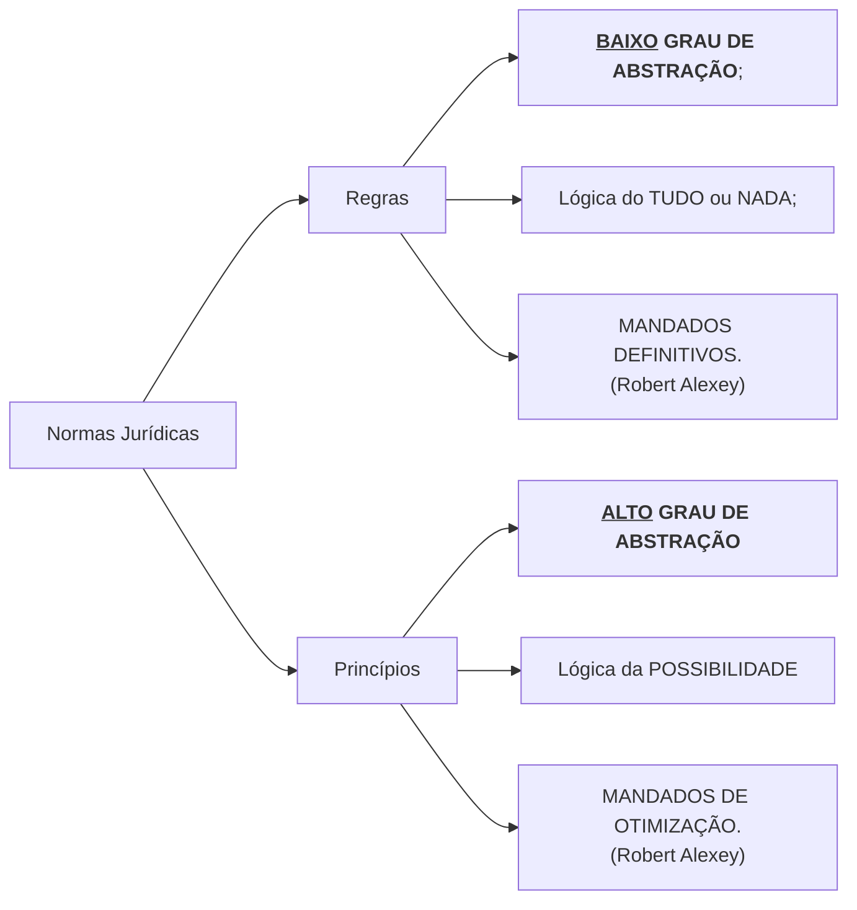

 

<b>CENTRO UNIVERSITÁRIO UNIESP</b> 
<b>Bacharelado em Direito</b> 
<b>Disciplina</b>: Teoria do Direito (Introdução ao Estudo do Direito) 
<b>Professor</b>: MARCEL 
<b>Data</b>: 13 de maio de 2024, segunda-feira 
 
<b>Aluno</b>: Daniel Lima Claudino / 1º período 
 

<table align="right" border="0">
  <tr>
    <td align="center" valign="top">
      <a href="../../../README.md">
         Início deste  Repositório
      </a>
    </td>
    <td align="center" valign="top">
      <a href="../README.md">
         Sumário da Fonte
      </a>
    </td>
    <td align="center" valign="top">
         Baixar em PDF
    </td>
  </tr>
</table>     

# Notas de Aula

## 1. Conteúdo da Aula

### Conceito Preliminar de Norma Jurídica

- A norma jurídica é uma regra de conduta prescrita pelo ordenamento jurídico, destinada a regular o comportamento humano em sociedade.
  - Ela é caracterizada pela sua coercibilidade, ou seja, a possibilidade de ser imposta mediante a força pelo Estado.
- As normas jurídicas estabelecem direitos e deveres, criando expectativas de comportamento e servindo como parâmetro para a solução de conflitos.

Segundo **Nader (2016, p. 86)**, as CATEGORIAS MAIS GERAIS de NORMAS JURÍDICAS possuem as seguintes CARACTERÍSTICAS:

- Bilateralidade;
- Generalidade;
- Abstratividade;
- Imperatividade;
- Coercibilidade;

### Princípios do Direito

- Os três autores:

#### Hebert Hart x Ronald Dworkin

- Norma jurídica enquanto gênero que comporta duas espécies:
  - Regras;
  - Princípios
- Dentro da **perspectiva da INTERPRETAÇÃO DAS NORMAS JURÍDICAS**, as diferências entre Ronald Dworkin x Hebert Hart consistem em:
  - Para **Hebert Hart**:
    - Hart adere ao **POSITIVISMO** e a **ESCOLA DE KELSEN**;
    - Para ele **só existem REGRAS** (não existem princípios);
    - Na possível omissão da lei, **A DISCRICIONARIEDADE** <b><u>do juiz</u></b> pode resolver a lacuna;
  - Para **Ronald Dworkin**:
    - O ordenamento jurídico **NÃO ADMITE** <b><u>lacunas</u></b> que, em última instância, **não possam ser resolvidas** <b><u>pelo juíz</u></b> dentro do próprio ordenamento, <b><u>SEM A DISCRICIONARIEDADE</u></b>;
    - Para resolver os **CASOS PRÁTICOS** pode-se utilizar **PRINCÍPIOS** constantes dentro do próprio ordenamento jurídico;
    - As REGRAS
      - Possuem <b><u>BAIXO</u> GRAU DE ABSTRAÇÃO</b>;
      - Operam pela lógica do **TUDO** ou **NADA**;
    - Os PRINCÍPIOS
      - Possuem <b><u>ALTO</u> GRAU DE ABSTRAÇÃO</b>;
      - Operam pela lógica da **POSSIBILIDADE**;

#### Robert Alexey

- Contribui para a teoria de Dworkin;
- As REGRAS:
  - Operam pela lógica do **TUDO ou NADA**;
  - Correlacionam-se por **SUBSUNÇÃO**;
  - São **MANDADOS DEFINITIVOS**
- Os PRINCÍPIOS:
  - Operam em **GRADAÇÃO**;
  - Correlacionam-se por **PONDERAÇÃO**;
  - São **MANDADOS DE OTIMIZAÇÃO**;

#### As Regras

- As regras possuem <b><u>estruturas fixas</u></b> que permitem e facilitam o silogismo, "Se **A**, então <b><u>deve ser</u></b> **B**, contendo a **previsão da sansão**;

#### Os princípios

- Princípios podem ser **ESCRITOS** e **NÃO ESCRITOS**;
- Principios são revelados a partir da **INTERPRETAÇÃO** dos juristas sobre o ordenamento jurídico;
- Princípios, a partir da INTERPRETAÇÃO, são revelados de maneira que permeia o conjunto normativo, influenciando a **criação**, **interpretação** e **aplicação** das regras;
- Segundo a clássica definição de **Celso Antônio Bandeira de Mello**:
  - "O **princípio** é um mandamento nuclear de um sistema, verdadeiro alicerce dele, disposição fundamental que se irradia sobre diferentes normas compondo-lhes o espírito e servindo de critério para a sua exata compreensão e inteligência, exatamente para definir a lógica e racionalidade do sistema normativo, no que lhe confere a tônica de lhe dá sentido harmônico"[^MELLO-2004].

### Distinção entre Princípios Constitucionais e Princípios Gerais do Direito

- **PRINCÍPIO CONSTITUCIONAL**
  - Por causa disso, figuram no **topo** do ordenamento jurídico norteando as **normas jurídicas** que se originam a partir da constituição federal
  - São produtivo do **neoconstitucionalismo**;
- Princípios Gerais do Direito
  - De acordo com o art. 4º da LINDB, são **fontes subsidiárias** do Direito;
  - Derivam dos **BROCARDOS JURÍDICOS** oriundos das interpretações dos juristas;

### Fontes do Direito

- **FONTES MATERIAIS**
  - São todas as fatores abaixo que influenciam no surgimento ou modificação de normas jurídicas (institutos jurídicos):
    - Fatores sociais;
    - Fatores políticos
      - Pessoas envolvidas
    - Opinião pública
    - Fatores culturais;
    - Fatores históricos;
    - Fatores geográtficos;
    - Fatores religiosos;
    - Fatores biológicos
    - etc.
- **FONTES FORMAIS**
  - Estatais
    - A lei;
    - A Jurisprudência;
  - Não Estatais
    - Doutrina;
    - Costume;
    - Analogia;
    - Princípios Gerais do Direito;

## 2. Tópicos a serem abordados na próxima aula

- Na próxima aula será abordados o assunto: Fontes do Direito

## 3. Anotações Relevantes Feitas Durante a Aula

- Nenhuma, nesta data 🗓.

## 4. Avisos / Observações

- Nenhum, nesta data 🗓.

## 5. Material Disponibilizado na Área do Aluno

- Link para Seção de Arquivos da Área do Aluno: https://portaltotvs.iesp.edu.br:60443/FrameHTML/web/app/edu/PortalEducacional/#/arquivos;
- Nenhum, nesta data 🗓.

## 6. Atividades / Trabalhos em Sala (Valendo Nota)

- Nenhuma, nesta data 🗓.

## 7. Referências Bibliográficas

[^MELLO-2004]: MELLO, Celso Antônio Bandeira de. Curso de direito administrativo. 17 ed. São Paulo: Malheiros, 2004, p .451.