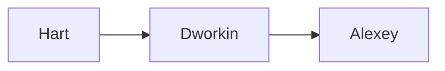
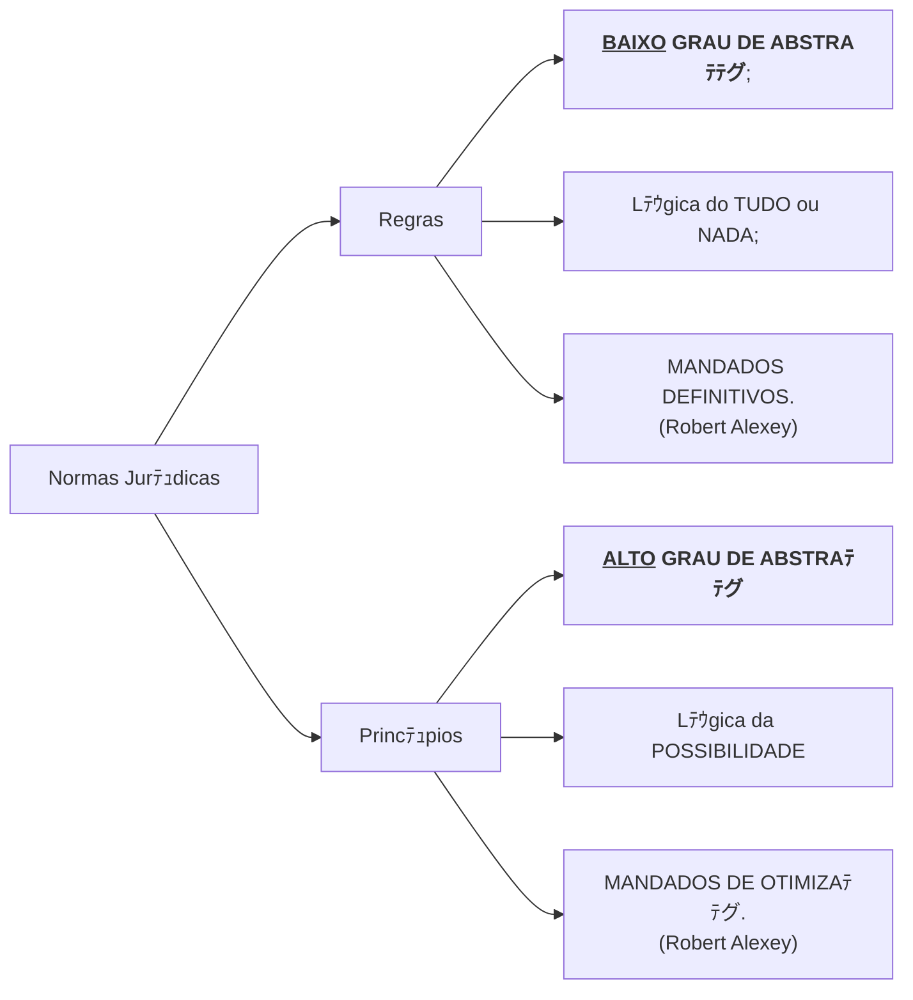

 

<b>CENTRO UNIVERSITﾃヽIO UNIESP</b> 
<b>Bacharelado em Direito</b> 
<b>Disciplina</b>: Teoria do Direito (Introduﾃｧﾃ｣o ao Estudo do Direito) 
<b>Professor</b>: MARCEL 
<b>Data</b>: 13 de maio de 2024, segunda-feira 
 
<b>Aluno</b>: Daniel Lima Claudino / 1ﾂｺ perﾃｭodo 
 

<table align="right" border="0">
  <tr>
    <td align="center" valign="top">
      <a href="../../../README.md">
         Inﾃｭcio deste  Repositﾃｳrio
      </a>
    </td>
    <td align="center" valign="top">
      <a href="../README.md">
         Sumﾃ｡rio da Fonte
      </a>
    </td>
    <td align="center" valign="top">
         Baixar em PDF
    </td>
  </tr>
</table>     

# Notas de Aula

## 1. Conteﾃｺdo da Aula

### Conceito Preliminar de Norma Jurﾃｭdica

- A norma jurﾃｭdica ﾃｩ uma regra de conduta prescrita pelo ordenamento jurﾃｭdico, destinada a regular o comportamento humano em sociedade.
  - Ela ﾃｩ caracterizada pela sua coercibilidade, ou seja, a possibilidade de ser imposta mediante a forﾃｧa pelo Estado.
- As normas jurﾃｭdicas estabelecem direitos e deveres, criando expectativas de comportamento e servindo como parﾃ｢metro para a soluﾃｧﾃ｣o de conflitos.

Segundo **Nader (2016, p. 86)**, as CATEGORIAS MAIS GERAIS de NORMAS JURﾃ好ICAS possuem as seguintes CARACTERﾃ拘TICAS:

- Bilateralidade;
- Generalidade;
- Abstratividade;
- Imperatividade;
- Coercibilidade;

### Princﾃｭpios do Direito

- Os trﾃｪs autores:

#### Hebert Hart x Ronald Dworkin

- Norma jurﾃｭdica enquanto gﾃｪnero que comporta duas espﾃｩcies:
  - Regras;
  - Princﾃｭpios
- Dentro da **perspectiva da INTERPRETAﾃﾃグ DAS NORMAS JURﾃ好ICAS**, as diferﾃｪncias entre Ronald Dworkin x Hebert Hart consistem em:
  - Para **Hebert Hart**:
    - Hart adere ao **POSITIVISMO** e a **ESCOLA DE KELSEN**;
    - Para ele **sﾃｳ existem REGRAS** (nﾃ｣o existem princﾃｭpios);
    - Na possﾃｭvel omissﾃ｣o da lei, **A DISCRICIONARIEDADE** <b><u>do juiz</u></b> pode resolver a lacuna;
  - Para **Ronald Dworkin**:
    - O ordenamento jurﾃｭdico **Nﾃグ ADMITE** <b><u>lacunas</u></b> que, em ﾃｺltima instﾃ｢ncia, **nﾃ｣o possam ser resolvidas** <b><u>pelo juﾃｭz</u></b> dentro do prﾃｳprio ordenamento, <b><u>SEM A DISCRICIONARIEDADE</u></b>;
    - Para resolver os **CASOS PRﾃゝICOS** pode-se utilizar **PRINCﾃ恒IOS** constantes dentro do prﾃｳprio ordenamento jurﾃｭdico;
    - As REGRAS
      - Possuem <b><u>BAIXO</u> GRAU DE ABSTRAﾃﾃグ</b>;
      - Operam pela lﾃｳgica do **TUDO** ou **NADA**;
    - Os PRINCﾃ恒IOS
      - Possuem <b><u>ALTO</u> GRAU DE ABSTRAﾃﾃグ</b>;
      - Operam pela lﾃｳgica da **POSSIBILIDADE**;

#### Robert Alexey

- Contribui para a teoria de Dworkin;
- As REGRAS:
  - Operam pela lﾃｳgica do **TUDO ou NADA**;
  - Correlacionam-se por **SUBSUNﾃﾃグ**;
  - Sﾃ｣o **MANDADOS DEFINITIVOS**
- Os PRINCﾃ恒IOS:
  - Operam em **GRADAﾃﾃグ**;
  - Correlacionam-se por **PONDERAﾃﾃグ**;
  - Sﾃ｣o **MANDADOS DE OTIMIZAﾃﾃグ**;

#### As Regras

- As regras possuem <b><u>estruturas fixas</u></b> que permitem e facilitam o silogismo, "Se **A**, entﾃ｣o <b><u>deve ser</u></b> **B**, contendo a **previsﾃ｣o da sansﾃ｣o**;

#### Os princﾃｭpios

- Princﾃｭpios podem ser **ESCRITOS** e **Nﾃグ ESCRITOS**;
- Principios sﾃ｣o revelados a partir da **INTERPRETAﾃﾃグ** dos juristas sobre o ordenamento jurﾃｭdico;
- Princﾃｭpios, a partir da INTERPRETAﾃﾃグ, sﾃ｣o revelados de maneira que permeia o conjunto normativo, influenciando a **criaﾃｧﾃ｣o**, **interpretaﾃｧﾃ｣o** e **aplicaﾃｧﾃ｣o** das regras;
- Segundo a clﾃ｡ssica definiﾃｧﾃ｣o de **Celso Antﾃｴnio Bandeira de Mello**:
  - "O **princﾃｭpio** ﾃｩ um mandamento nuclear de um sistema, verdadeiro alicerce dele, disposiﾃｧﾃ｣o fundamental que se irradia sobre diferentes normas compondo-lhes o espﾃｭrito e servindo de critﾃｩrio para a sua exata compreensﾃ｣o e inteligﾃｪncia, exatamente para definir a lﾃｳgica e racionalidade do sistema normativo, no que lhe confere a tﾃｴnica de lhe dﾃ｡ sentido harmﾃｴnico"[^MELLO-2004].

### Distinﾃｧﾃ｣o entre Princﾃｭpios Constitucionais e Princﾃｭpios Gerais do Direito

- **PRINCﾃ恒IO CONSTITUCIONAL**
  - Por causa disso, figuram no **topo** do ordenamento jurﾃｭdico norteando as **normas jurﾃｭdicas** que se originam a partir da constituiﾃｧﾃ｣o federal
  - Sﾃ｣o produtivo do **neoconstitucionalismo**;
- Princﾃｭpios Gerais do Direito
  - De acordo com o art. 4ﾂｺ da LINDB, sﾃ｣o **fontes subsidiﾃ｡rias** do Direito;
  - Derivam dos **BROCARDOS JURﾃ好ICOS** oriundos das interpretaﾃｧﾃｵes dos juristas;

### Fontes do Direito

- **FONTES MATERIAIS**
  - Sﾃ｣o todas as fatores abaixo que influenciam no surgimento ou modificaﾃｧﾃ｣o de normas jurﾃｭdicas (institutos jurﾃｭdicos):
    - Fatores sociais;
    - Fatores polﾃｭticos
      - Pessoas envolvidas
    - Opiniﾃ｣o pﾃｺblica
    - Fatores culturais;
    - Fatores histﾃｳricos;
    - Fatores geogrﾃ｡tficos;
    - Fatores religiosos;
    - Fatores biolﾃｳgicos
    - etc.
- **FONTES FORMAIS**
  - Estatais
    - A lei;
    - A Jurisprudﾃｪncia;
  - Nﾃ｣o Estatais
    - Doutrina;
    - Costume;
    - Analogia;
    - Princﾃｭpios Gerais do Direito;

## 2. Tﾃｳpicos a serem abordados na prﾃｳxima aula

- Na prﾃｳxima aula serﾃ｡ abordados o assunto: Fontes do Direito

## 3. Anotaﾃｧﾃｵes Relevantes Feitas Durante a Aula

- Nenhuma, nesta data 欄.

## 4. Avisos / Observaﾃｧﾃｵes

- Nenhum, nesta data 欄.

## 5. Material Disponibilizado na ﾃ〉ea do Aluno

- Link para Seﾃｧﾃ｣o de Arquivos da ﾃ〉ea do Aluno: https://portaltotvs.iesp.edu.br:60443/FrameHTML/web/app/edu/PortalEducacional/#/arquivos;
- Nenhum, nesta data 欄.

## 6. Atividades / Trabalhos em Sala (Valendo Nota)

- Nenhuma, nesta data 欄.

## 7. Referﾃｪncias Bibliogrﾃ｡ficas

[^MELLO-2004]: MELLO, Celso Antﾃｴnio Bandeira de. Curso de direito administrativo. 17 ed. Sﾃ｣o Paulo: Malheiros, 2004, p .451.