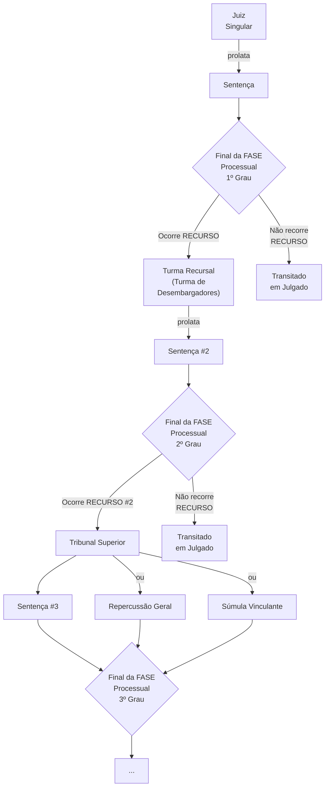

 

<b>CENTRO UNIVERSITÁRIO UNIESP</b> 
<b>Bacharelado em Direito</b> 
<b>Disciplina</b>: Teoria do Direito (Introdução ao Estudo do Direito) 
<b>Professor</b>: MARCEL 
<b>Data</b>: 20 de maio de 2024, segunda-feira 
 
<b>Aluno</b>: Daniel Lima Claudino / 1º período 
 

<table align="right" border="0">
  <tr>
    <td align="center" valign="top">
      <a href="../../../README.md">
         Início deste  Repositório
      </a>
    </td>
    <td align="center" valign="top">
      <a href="../README.md">
         Sumário da Fonte
      </a>
    </td>
    <td align="center" valign="top">
         Baixar em PDF
    </td>
  </tr>
</table>     

# Notas de Aula

## 1. Conteúdo da Aula

<h2>FONTES FORMAIS DO DIREITO</h2>

## Leis

### Leis em sentido MATERIAL

- Tem **[ABSTRATATIVIDADE](https://github.com/dnlclaudino/introducao-ao-estudo-do-direito/blob/master/livro-NADER-2016-introducao-ao-estudo-do-direito/capitulo-09-norma-juridica.md#abstratividade)** e **[GENERALIDADE](https://github.com/dnlclaudino/introducao-ao-estudo-do-direito/blob/master/livro-NADER-2016-introducao-ao-estudo-do-direito/capitulo-09-norma-juridica.md#generalidade)**

### Leis em sentido FORMAL

- É o produto do **PROCESSO LEGISLATIVO**;

## Jurisprudência

- É a **reiteração** de uma **mesma decisão**, <b><u>por um mesmo TRIBUNAL</u></b>, sobre uma mesma matéria.
- Segundo [glossário do STF](https://portal.stf.jus.br/jurisprudencia/glossario.asp):
  - **JURISPRUDÊNCIA**
    - Conjunto de decisões reiteradas de juízes e tribunais sobre algum tema;
    - Orientação uniforme dos tribunais na decisão de casos semelhantes)
  - **JURISDIÇÃO**
    - Autoridade do detentor da soberania de enunciar o direito;
    - Aplicação de normas jurídicas aos casos específicos, exercida pelo Estado;
    - Administração da justiça, exercida pelo Poder Judiciário;
    - Poder-dever dos magistrados de aplicar o direito;
    - Domínio territorial em que uma autoridade judicial pode exercer sua atividade jurisdicional;
  - **INSTÂNCIA**
    - Grau de jurisdição ou juízo em que tramita a ação. As ações, em geral, se iniciam na primeira instância. A segunda instância dedica-se ao julgamento de recursos. A terceira instância ou instância superior refere-se ao trâmite da ação nos tribunais superiores (STJ, TST, TSE) e no STF, para apreciação de recursos contra decisões dos tribunais de segunda instância;
    - Conjunto de autoridades competentes para acatar um pedido;
  - **GRAU DE JURISDIÇÃO**
    - Ordem hierárquica da instância judicial em que tramita a ação. Divide-se em: primeiro grau (exercido por um juiz singular), segundo grau (desempenhado por tribunais estaduais ou federais) e superior (cumprido por tribunais superiores);
      - **Fundamentação Legal**: Artigo 64, § 1º; 144, II; 227; 342, III; 438; 516, II; 938, §§ 1º e 3º, do CPC/2015. 

### Fluxo de uma Ação Judicial

## Princípios

## Costumes

## Doutrina

## 2. Tópicos a serem abordados na próxima aula

- Nenhuma, nesta data 🗓.

## 3. Anotações Relevantes Feitas Durante a Aula

- Nenhuma, nesta data 🗓.

## 4. Avisos / Observações

- Nenhum, nesta data 🗓.

## 5. Material Disponibilizado na Área do Aluno

- Link para Seção de Arquivos da Área do Aluno: https://portaltotvs.iesp.edu.br:60443/FrameHTML/web/app/edu/PortalEducacional/#/arquivos;
- Nenhum, nesta data 🗓.

## 6. Atividades / Trabalhos em Sala (Valendo Nota)

- Nenhuma, nesta data 🗓.

## 7. Referências Bibliográficas

- Nenhuma, nesta data 🗓.
