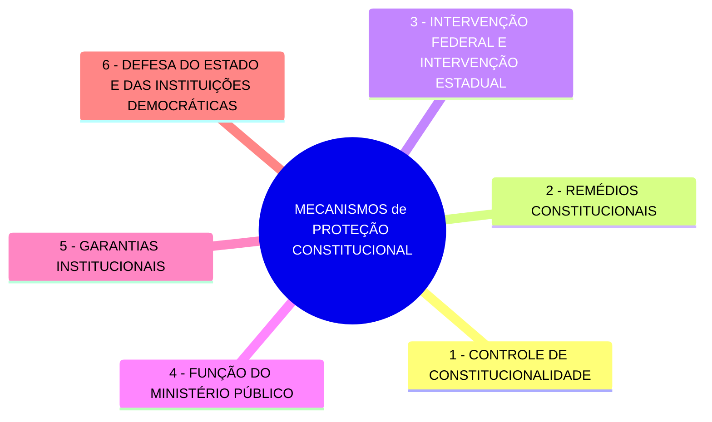
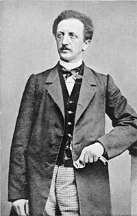
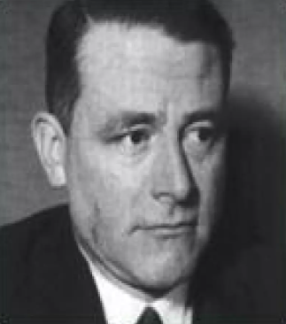
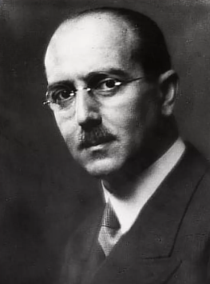
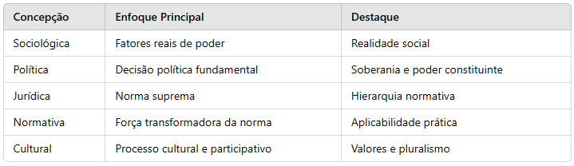

 

<b>CENTRO UNIVERSITÁRIO UNIESP</b> 
<b>Bacharelado em Direito</b> 
<b>Disciplina</b>: Fundamentos Constitucionais (Direito Constitucional I) 
<b>Professora</b>: CLAUDIO MARCOS ROMERO LAMEIRÃO 
<b>Data</b>: 09 de dezembro de 2024, terça-feira 
 
<b>Aluno</b>: Daniel Lima Claudino / 2º período 
 

<table align="right" border="0">
  <tr>
    <td align="center" valign="top">
      <a href="../../../README.md">
         Início deste  Repositório
      </a>
    </td>
    <td align="center" valign="top">
      <a href="../README.md">
         Sumário da Fonte
      </a>
    </td>
    <td align="center" valign="top">
         Baixar em PDF
    </td>
  </tr>
</table>      

<h1>REVISÃO PARA PROVA DE REPOSIÇÃO #1</h1>

<h2>Sumário</h2>

<!-- TOC -->

- [CONSTITUIÇÃO](#constituição)
  - [Conceito de Constituição](#conceito-de-constituição)
- [OUTROS CONCEITOS IMPORTANTES](#outros-conceitos-importantes)
- [PROPOSIÇÕES DE NORMAS JURÍDICAS](#proposições-de-normas-jurídicas)
- [SUPREMACIA DA CONSTITUIÇÃO](#supremacia-da-constituição)
  - [Supremacia Formal](#supremacia-formal)
    - [Características da SUPREMACIA FORMAL](#características-da-supremacia-formal)
      - [Exemplo](#exemplo)
  - [Supremacia Material](#supremacia-material)
    - [Características da SUPREMACIA MATERIAL](#características-da-supremacia-material)
      - [Exemplo](#exemplo-1)
  - [Conexão entre as Supremacias](#conexão-entre-as-supremacias)
  - [Importância da Distinção entre Supremacial FORMAL e MATERIAL](#importância-da-distinção-entre-supremacial-formal-e-material)
- [MECANISMOS DE PROTEÇÃO CONSTITUCIONAL](#mecanismos-de-proteção-constitucional)
- [CONCEPÇÕES DA CONSTITUIÇÃO](#concepções-da-constituição)
    - [Concepção Sociológica](#concepção-sociológica)
    - [Concepção Política](#concepção-política)
    - [Concepção Jurídica](#concepção-jurídica)
    - [Concepção Normativa](#concepção-normativa)
    - [Concepção Cultural](#concepção-cultural)
  - [Resumo](#resumo)
- [CLASSIFICAÇÃO DAS CONSTITUIÇÕES](#classificação-das-constituições)
  - [Origem](#origem)
  - [Forma](#forma)
  - [Modo de Elaboração](#modo-de-elaboração)
  - [Extensão](#extensão)
  - [Conteúdo](#conteúdo)
  - [Estabilidade](#estabilidade)
- [PODER CONSTITUINTE](#poder-constituinte)
  - [Originário](#originário)
  - [Derivado](#derivado)
  - [Difuso](#difuso)
  - [Supranacional](#supranacional)
- [EFICÁCIA E APLICABILIDADE DAS NORMAS CONSTITUCIONAIS](#eficácia-e-aplicabilidade-das-normas-constitucionais)
  - [Eficácia Plena](#eficácia-plena)
  - [Eficácia Contida](#eficácia-contida)
  - [Eficácia Limitada](#eficácia-limitada)

<!-- /TOC -->

## CONSTITUIÇÃO

### Conceito de Constituição

- É um documento jurídico mais relevante de um ordenamento jurídico;
- Isso se dá em virtude da sua supremacia frente a outras normas jurídicas;

## OUTROS CONCEITOS IMPORTANTES

- **VALIDADE**
  - Respeito ao processo legislativo exigido;
- **EFICÁCIA**
  - Aptidão para que a norma produza o seu regular efeito;
- **VIGÊNCIA**
  - Período em que a norma produz efeitos após a sua vacância;
- **VIGOR**
  - Capacidade da norma de produzir efeitos jurídicos, quer esteja em vigência ou não.
- **EFETIVIDADE**
  - Alcance social pretendido por uma norma jurídica

## PROPOSIÇÕES DE NORMAS JURÍDICAS

- Uma **EMENDA CONSTITUCIONAL** é proposta através:
  - De uma **PROPOSTA DE EMENTA À CONSTITUIÇÃO**;
- Uma **LEI** é proposta através:
  - De um **PROJETO DE LEI**

## SUPREMACIA DA CONSTITUIÇÃO

### Supremacia Formal

- A **SUPREMACIA FORMAL** refere-se à <b><u>POSIÇÃO HIERÁRQUICA</u></b> da Constituição no **ORDENAMENTO JURÍDICO**;
- **Por que a CONSTITUIÇÃO é superior as outras normas jurídicas ?**
  - Ela é superior às demais normas porque **segue um processo legislativo especial** para sua **CRIAÇÃO e MODIFICAÇÃO**;
- Esse processo é mais rígido do que o das leis ordinárias, evidenciado, por exemplo, pelas cláusulas pétreas no Brasil, que não podem ser abolidas ou modificadas nem por emendas constitucionais (art. 60, §4º, da Constituição Federal de 1988).

#### Características da SUPREMACIA FORMAL

- **RIGIDEZ CONSTITUCIONAL**
  - A Constituição exige procedimentos diferenciados e mais difíceis para sua alteração.
- **HIERARQUIA NORMATIVA**
  - Todas as demais normas do ordenamento jurídico **DEVEM ESTAR em conformidade com a Constituição**, sob pena de serem declaradas inconstitucionais.
- **CONTROLE DE CONSTITUCIONALIDADE**
  - <b><u>Instrumento</u></b> que <b><u>assegura a prevalência formal</u></b> da Constituição por meio da **INVALIDAÇÃO** de normas infraconstitucionais conflitantes.

##### Exemplo

- Um **decreto** ou **lei ordinária** que contradiga o texto constitucional será considerado **INVÁLIDO**.

### Supremacia Material

- A **SUPREMACIA MATERIAL** está relacionada ao <b><u>CONTEÚDO da Constituição</u></b>, ou seja, aos <b><u>VALORES FUNDAMENTAIS</u></b> e <b><u>PRINCÍPIOS FUNDAMENTAIS</u></b> que ela consagra, como:
  - A dignidade da pessoa humana;
  - A liberdade;
  - A igualdade; e
  - A justiça;
- Independentemente de seu caráter formal, esses conteúdos são considerados fundamentais e perenes no ordenamento jurídico.

#### Características da SUPREMACIA MATERIAL

- **PRINCÍPIOS FUNDAMENTAIS**
  - Elementos como os **DIREITOS FUNDAMENTAIS** e a **ESTRUTURA BÁSICA DO ESTADO** são de natureza materialmente superior.
- **CARÁTER ÉTICO E POLÍTICO**
  - Os <b><u>VALORES</u></b> materiais da Constituição <u>orientam todo o ordenamento jurídico</u> e a <u>atuação dos poderes estatais</u>.
- **PREVALÊNCIA UNIVERSAL**
  - Esses princípios se impõem como limites ao legislador constituinte e reformador, sendo protegidos pelas cláusulas pétreas.

##### Exemplo

- A dignidade da pessoa humana (art. 1º, III) não pode ser suprimida nem por emenda constitucional, pois é um valor material que permeia todo o ordenamento.

### Conexão entre as Supremacias

- A **SUPREMACIA FORMAL** é o mecanismo jurídico-institucional que assegura a força normativa da Constituição;
- A **SUPREMACIA MATERIAL** reflete seu conteúdo essencial e valorativo;
- Juntas, elas garantem que o texto constitucional seja ao mesmo tempo a base hierárquica do ordenamento e o reflexo de valores fundamentais que guiam a sociedade.

### Importância da Distinção entre Supremacial FORMAL e MATERIAL

- A importância dessa distinção está em reconhecer que, mesmo em face de uma modificação formalmente válida, o conteúdo material não pode ser violado.
- Por isso, a Constituição não é apenas uma norma superior em termos formais, mas também o repositório dos valores fundamentais que estruturam o ordenamento jurídico.

## MECANISMOS DE PROTEÇÃO CONSTITUCIONAL

- São **MECANISMOS** de **PROTEÇÃO CONSTITUCIONAL**:
  - **CONTROLE DE CONSTITUCIONALIDADE**
    - **PREVENTIVO**: Realizado antes da norma entrar em vigor, geralmente durante o processo legislativo.
      - Exemplos:
        - **VETO JURÍDICO** exercido pelo Presidente da República (art. 66, §1º, CF/88); ou
        - Atuação das **COMISSÕES** (de Constituição e Justiça no Legislativo, ETC.).
    - **REPRESSIVO**: Ocorre após a norma ser editada, sendo realizado por meio:
      - Controle **DIFUSO**: Realizado <b><u>por qualquer juiz ou tribunal</u></b>, aplicável a um caso concreto.
      - Controle **CONCENTRADO**: Realizado pelo Supremo Tribunal Federal (STF) em ações específicas, como:
        - **Ação Direta de Inconstitucionalidade (ADI)**
        - **Ação Declaratória de Constitucionalidade (ADC)**
        - **Arguição de Descumprimento de Preceito Fundamental (ADPF)**
        - **Ação Direta de Inconstitucionalidade por Omissão (ADO)**
  - **REMÉDIOS CONSTITUCIONAIS**
    - São <b><u>INSTRUMENTOS PROCESSUAIS</u></b> colocados à disposição dos cidadãos para proteção de direitos fundamentais previstos na Constituição
      - Os principais são:
        - **HABEAS CORPUS** (art. 5º, LXVIII): Protege o direito de locomoção contra ilegalidade ou abuso de poder.
        - **HABEAS DATA** (art. 5º, LXXII): Assegura o acesso a informações pessoais e a retificação de dados, quando necessário.
        - **MANDADO DE SEGURANÇA** (art. 5º, LXIX e LXX): Protege direito líquido e certo contra ilegalidade ou abuso de autoridade.
        - **MANDADO DE INJUNÇÃO** (art. 5º, LXXI): Visa assegurar o exercício de um direito constitucional quando falta norma regulamentadora.
        - **AÇÃO POPULAR** (art. 5º, LXXIII): Permite ao cidadão questionar atos lesivos ao patrimônio público, à moralidade administrativa, ao meio ambiente e ao patrimônio histórico-cultural.
  - **INTERVENÇÃO FEDERAL E INTERVENÇÃO ESTADUAL**
    - Instrumento político e jurídico utilizado para restabelecer a normalidade constitucional em casos graves. Previstos nos arts. 34 e 36 da CRFB:
      - No **ÂMBITO FEDERAL**: Quando necessário para garantir a integridade nacional, repelir invasão estrangeira ou preservar a ordem constitucional em Estados-Membros.
      - No **ÂMBITO ESTADUAL**: Para assegurar a observância dos princípios constitucionais sensíveis ou regular conflitos entre os entes federativos.
  - **FUNÇÃO DO MINISTÉRIO PÚBLICO**
    - O Ministério Público (art. 127, CF/88) tem papel central
      1. Na **PROTEÇÃO**:
           - Da ordem constitucional;
           - Dos direitos fundamentais; e
           - Do interesse público
      2. No exercício de **FUNÇÕES**:
           - De controle da **LEGALIDADE**; e
           - Da **MORALIDADE ADMINISTRATIVA**
      3. Na **FISCALIZAÇÃO** <b><u>OS PODERES PÚBLICOS</u></b>.
  - **GARANTIAS INSTITUCIONAIS**
    - São estruturas e órgãos que asseguram a proteção da Constituição e do Estado Democrático de Direito.
      - **Independência do Poder Judiciário**: Fundamental para a proteção da Constituição e dos direitos dos cidadãos.
      - **Atuação do STF**: Como guardião da Constituição (art. 102, CF/88), o Supremo Tribunal Federal exerce papel central na interpretação e proteção do texto constitucional.
  - **DEFESA DO ESTADO E DAS INSTITUIÇÕES DEMOCRÁTICAS**
    - Estado de defesa (art. 136, CRFB);
    - Estado de sítio (art. 137, CRFB)

## CONCEPÇÕES DA CONSTITUIÇÃO

- O tema das **CONCEPÇÕES DA CONSTITUIÇÃO** explora <b><u>diferentes</u></b> <b><u>FORMAS DE ENTENDER</u></b>
  - A **NATUREZA** da constituição;
  - O **PAPEL** da constituição; e
  - As **FUNÇÕES** da Constituição;
- As **CONCEPÇÕES DAS CONSTITUIÇÕES** variam conforme:
  - As **PERSPECTIVAS TEÓRICAS** de cada abordagem; e
  - Os **ENFOQUES** dados por cada abordagem.

#### Concepção Sociológica

  
<b>Figura</b>: FERDINAND LASSALLE.

  
  
<b>Fonte</b>: Wikipedia 

- Desenvolvida por **FERDINAND LASSALLE**, em sua obra **O que é uma Constituição?**;
- Defende que a **CONSTITUIÇÃO**: É a <b><u>SOMA</u></b> dos **FATORES REAIS DE PODER** em uma sociedade
  - **FATORES REAIS DE PODER**:
    - Forças **ECONÔMICAS** que governam efetivamente a sociedade;
    - Forças **POLÍTICAS** que governam efetivamente a sociedade; e
    - Forças **SOCIAIS** que governam efetivamente a sociedade.
- Segundo essa visão, a **EFICÁCIA DE UMA CONSTITUIÇÃO** depende:
  - De sua <b><u>correspondência com os FATORES REAIS DE PODER</u></b>;
  - Caso contrário, seria uma mera “**FOLHA DE PAPEL**”.
- **FOCO**:
  - A relação entre o <b><u>texto constitucional</u></b> e as <b><u>forças que governam efetivamente a sociedade</u></b>.

#### Concepção Política

  
<b>Figura</b>: CARL SCHMITT.

  
  
<b>Fonte</b>: Wikipedia 

- Defendida por **CARL SCHMITT**;
- Defende que a **CONSTITUIÇÃO**:
  - É o <b><u>RESULTADO</u></b> de uma **DECISÃO POLÍTICA FUNDAMENTAL** tomada pelo titular do poder constituinte (o povo).
  - É o instrumento de materialização da **VONTADE POLÍTICA** que organiza a estrutura do Estado e os direitos fundamentais.
- Diferencia-se das **NORMAS CONSTITUCIONAIS** (regras específicas), pois:
  - Considera a **CONSTITUIÇÃO** como <b><u>algo mais abrangente</u></b>;
  - Considera a **CONSTITUIÇÃO** vinculada <b><u>à soberania</u></b>.
- **FOCO**:
  - A Constituição como um <b><u>ato político supremo</u></b>.

#### Concepção Jurídica

  
<b>Figura</b>: HANS KELSEN.

  
  
<b>Fonte</b>: Wikipedia 

- Desenvolvida por **HANS KELSEN**;
- Concebe a Constituição:
  - Como uma **NORMA JURÍDICA SUPREMA**;
  - Como **BASE DE VALIDADE** de todo o <b><u>ordenamento jurídico</u></b>.
- Para Kelsen:
  - A Constituição possui primazia hierárquica;
  - A constituição organiza o funcionamento do Estado; e
  - A constituição organiza os direitos fundamentais;
  - A constituição é indispensável para a <b><u>unidade do sistema jurídico</u></b>.
- **FOCO**:
  - A Constituição como <b><u>NORMA JURÍDICA FORMALMENTE SUPERIOR</u></b>, independente de aspectos sociológicos ou políticos.

#### Concepção Normativa

  
<b>Figura</b>: KONRAD HESSE.

  
  
<b>Fonte</b>: Wikipedia 

- Inspirada em **KELSEN**, mas aprofundada por autores como **KONRAD HESSE**;
- **DESTACAM** a <b><u>FORÇA NORMATIVA</u></b> da Constituição, ou seja, sua <b><u>capacidade de influenciar e moldar a realidade</u></b>.
- Defende que, <b><u>para a Constituição TER EFICÁCIA</u></b>, é necessário:
  - Um **COMPROMISSO SOCIAL** para aplicá-la, superando os fatores contrários à sua realização;
  - Um **POLÍTICO** para aplicá-la, superando os fatores contrários à sua realização.
- Foco: A Constituição como norma com força vinculante e transformadora da realidade.

#### Concepção Cultural

  
<b>Figura</b>: PETER HÄBERLE.

  
  
<b>Fonte</b>: Wikipedia 

- Desenvolvida por autores como **PETER HÄBERLE**;
- Entendem a Constituição
  - Como <b><u>UMA REALIDADE CULTURAL</u></b>, influenciada pelos:
    - **VALORES** de uma sociedade;
    - **TRADIÇÕES** de uma sociedade; e
    - **PRÁTICAS** de uma sociedade.
- Nessa perspectiva, a <b><u>INTERPRETAÇÃO CONSTITUCIONAL</u></b>:
  - Deve ser pluralista;
  - Deve ser aberta à participação de diferentes atores sociais; e
  - Deve ser aberta ao diálogo entre culturas e instituições.
- Foco: A Constituição como <b><u>reflexo</u></b> e <b><u>resultado</u></b> de **PROCESSOS CULTURAIS DINÂMICOS**.

### Resumo

## CLASSIFICAÇÃO DAS CONSTITUIÇÕES

### Origem
### Forma
### Modo de Elaboração
### Extensão
### Conteúdo
### Estabilidade

## PODER CONSTITUINTE

### Originário

### Derivado

- Decorrente
- Revisor
- Reformador

### Difuso

- Seu OBJETIVO é alterar a constituição por meio de um PROCESSO INFORMAL, ou seja, modificando o SENTIDO INTERPRETATIVO DA NORMA e não o seu conteúdo;

### Supranacional

- É um poder constituinte que:
  - CRIA uma CONSTITUIÇÃO;
  - O Estado cede uma parcela de sua SOBERANIA para que uma <b><u>CONSTITUIÇÃO COMUNITÁRIA SEJA CRIADA</u></b>.
    - Exemplo: **UNIÃO EUROPÉIA**

## EFICÁCIA E APLICABILIDADE DAS NORMAS CONSTITUCIONAIS

### Eficácia Plena

### Eficácia Contida

### Eficácia Limitada