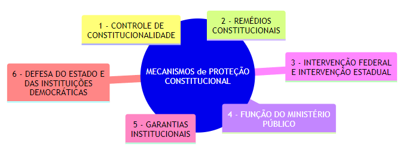

 

<b>CENTRO UNIVERSITÁRIO UNIESP</b> 
<b>Bacharelado em Direito</b> 
<b>Disciplina</b>: Fundamentos Constitucionais (Direito Constitucional I) 
<b>Professora</b>: CLAUDIO MARCOS ROMERO LAMEIRÃO 
<b>Data</b>: 09 de dezembro de 2024, terça-feira 
 
<b>Aluno</b>: Daniel Lima Claudino / 2º período 
 

<table align="right" border="0">
  <tr>
    <td align="center" valign="top">
      <a href="../../../README.md">
         Início deste  Repositório
      </a>
    </td>
    <td align="center" valign="top">
      <a href="../README.md">
         Sumário da Fonte
      </a>
    </td>
    <td align="center" valign="top">
         Baixar em PDF
    </td>
  </tr>
</table>      

<h1>REVISÃO PARA PROVA DE REPOSIÇÃO #1</h1>

<h2>Sumário</h2>

<!-- TOC -->

- [CONSTITUIÇÃO](#constituição)
  - [Conceito de Constituição](#conceito-de-constituição)
- [OUTROS CONCEITOS IMPORTANTES](#outros-conceitos-importantes)
- [PROPOSIÇÕES DE NORMAS JURÍDICAS](#proposições-de-normas-jurídicas)
- [SUPREMACIA DA CONSTITUIÇÃO](#supremacia-da-constituição)
  - [Supremacia Formal](#supremacia-formal)
    - [Características da SUPREMACIA FORMAL](#características-da-supremacia-formal)
      - [Exemplo](#exemplo)
  - [Supremacia Material](#supremacia-material)
    - [Características da SUPREMACIA MATERIAL](#características-da-supremacia-material)
      - [Exemplo](#exemplo-1)
  - [Conexão entre as Supremacias](#conexão-entre-as-supremacias)
  - [Importância da Distinção entre Supremacial FORMAL e MATERIAL](#importância-da-distinção-entre-supremacial-formal-e-material)
- [MECANISMOS DE PROTEÇÃO CONSTITUCIONAL](#mecanismos-de-proteção-constitucional)
- [CONCEPÇÕES DA CONSTITUIÇÃO](#concepções-da-constituição)
    - [Concepção Sociológica](#concepção-sociológica)
    - [Concepção Política](#concepção-política)
    - [Concepção Jurídica](#concepção-jurídica)
    - [Concepção Normativa](#concepção-normativa)
    - [Concepção Cultural](#concepção-cultural)
  - [Resumo](#resumo)
- [CLASSIFICAÇÃO DAS CONSTITUIÇÕES](#classificação-das-constituições)
  - [Origem](#origem)
  - [Forma](#forma)
  - [Modo de Elaboração](#modo-de-elaboração)
  - [Extensão](#extensão)
  - [Conteúdo](#conteúdo)
  - [Estabilidade](#estabilidade)
- [PODER CONSTITUINTE](#poder-constituinte)
  - [Poder Constituinte Originário](#poder-constituinte-originário)
  - [Poder Constituinte Derivado](#poder-constituinte-derivado)
  - [Poder Constituinte Difuso](#poder-constituinte-difuso)
  - [Supranacional](#supranacional)
- [EFICÁCIA E APLICABILIDADE DAS NORMAS CONSTITUCIONAIS](#eficácia-e-aplicabilidade-das-normas-constitucionais)
  - [Normas de eficácia plena](#normas-de-eficácia-plena)
  - [Normas de eficácia contida](#normas-de-eficácia-contida)
  - [Normas de eficácia limitada](#normas-de-eficácia-limitada)
  - [Características da aplicabilidade](#características-da-aplicabilidade)

<!-- /TOC -->

## CONSTITUIÇÃO

### Conceito de Constituição

- É um documento jurídico mais relevante de um ordenamento jurídico;
- Isso se dá em virtude da sua supremacia frente a outras normas jurídicas;

## OUTROS CONCEITOS IMPORTANTES

- **VALIDADE**
  - Respeito ao processo legislativo exigido;
- **EFICÁCIA**
  - Aptidão para que a norma produza o seu regular efeito;
- **VIGÊNCIA**
  - Período em que a norma produz efeitos após a sua vacância;
- **VIGOR**
  - Capacidade da norma de produzir efeitos jurídicos, quer esteja em vigência ou não.
- **EFETIVIDADE**
  - Alcance social pretendido por uma norma jurídica

## PROPOSIÇÕES DE NORMAS JURÍDICAS

- Uma **EMENDA CONSTITUCIONAL** é proposta através:
  - De uma **PROPOSTA DE EMENTA À CONSTITUIÇÃO**;
- Uma **LEI** é proposta através:
  - De um **PROJETO DE LEI**

## SUPREMACIA DA CONSTITUIÇÃO

### Supremacia Formal

- A **SUPREMACIA FORMAL** refere-se à <b><u>POSIÇÃO HIERÁRQUICA</u></b> da Constituição no **ORDENAMENTO JURÍDICO**;
- **Por que a CONSTITUIÇÃO é superior as outras normas jurídicas ?**
  - Ela é superior às demais normas porque **segue um processo legislativo especial** para sua **CRIAÇÃO e MODIFICAÇÃO**;
- Esse processo é mais rígido do que o das leis ordinárias, evidenciado, por exemplo, pelas cláusulas pétreas no Brasil, que não podem ser abolidas ou modificadas nem por emendas constitucionais (art. 60, §4º, da Constituição Federal de 1988).

#### Características da SUPREMACIA FORMAL

- **RIGIDEZ CONSTITUCIONAL**
  - A Constituição exige procedimentos diferenciados e mais difíceis para sua alteração.
- **HIERARQUIA NORMATIVA**
  - Todas as demais normas do ordenamento jurídico **DEVEM ESTAR em conformidade com a Constituição**, sob pena de serem declaradas inconstitucionais.
- **CONTROLE DE CONSTITUCIONALIDADE**
  - <b><u>Instrumento</u></b> que <b><u>assegura a prevalência formal</u></b> da Constituição por meio da **INVALIDAÇÃO** de normas infraconstitucionais conflitantes.

##### Exemplo

- Um **decreto** ou **lei ordinária** que contradiga o texto constitucional será considerado **INVÁLIDO**.

### Supremacia Material

- A **SUPREMACIA MATERIAL** está relacionada ao <b><u>CONTEÚDO da Constituição</u></b>, ou seja, aos <b><u>VALORES FUNDAMENTAIS</u></b> e <b><u>PRINCÍPIOS FUNDAMENTAIS</u></b> que ela consagra, como:
  - A dignidade da pessoa humana;
  - A liberdade;
  - A igualdade; e
  - A justiça;
- Independentemente de seu caráter formal, esses conteúdos são considerados fundamentais e perenes no ordenamento jurídico.

#### Características da SUPREMACIA MATERIAL

- **PRINCÍPIOS FUNDAMENTAIS**
  - Elementos como os **DIREITOS FUNDAMENTAIS** e a **ESTRUTURA BÁSICA DO ESTADO** são de natureza materialmente superior.
- **CARÁTER ÉTICO E POLÍTICO**
  - Os <b><u>VALORES</u></b> materiais da Constituição <u>orientam todo o ordenamento jurídico</u> e a <u>atuação dos poderes estatais</u>.
- **PREVALÊNCIA UNIVERSAL**
  - Esses princípios se impõem como limites ao legislador constituinte e reformador, sendo protegidos pelas cláusulas pétreas.

##### Exemplo

- A dignidade da pessoa humana (art. 1º, III) não pode ser suprimida nem por emenda constitucional, pois é um valor material que permeia todo o ordenamento.

### Conexão entre as Supremacias

- A **SUPREMACIA FORMAL** é o mecanismo jurídico-institucional que assegura a força normativa da Constituição;
- A **SUPREMACIA MATERIAL** reflete seu conteúdo essencial e valorativo;
- Juntas, elas garantem que o texto constitucional seja ao mesmo tempo a base hierárquica do ordenamento e o reflexo de valores fundamentais que guiam a sociedade.

### Importância da Distinção entre Supremacial FORMAL e MATERIAL

- A importância dessa distinção está em reconhecer que, mesmo em face de uma modificação formalmente válida, o conteúdo material não pode ser violado.
- Por isso, a Constituição não é apenas uma norma superior em termos formais, mas também o repositório dos valores fundamentais que estruturam o ordenamento jurídico.

## MECANISMOS DE PROTEÇÃO CONSTITUCIONAL

  
<b>Figura</b>: Mecanismos de proteção constitucional

  
  
<b>Fonte</b>: Elaborado pelo autor (mermaid) 

- São **MECANISMOS** de **PROTEÇÃO CONSTITUCIONAL**:
  - **CONTROLE DE CONSTITUCIONALIDADE**
    - **PREVENTIVO**: Realizado antes da norma entrar em vigor, geralmente durante o processo legislativo.
      - Exemplos:
        - **VETO JURÍDICO** exercido pelo Presidente da República (art. 66, §1º, CF/88); ou
        - Atuação das **COMISSÕES** (de Constituição e Justiça no Legislativo, ETC.).
    - **REPRESSIVO**: Ocorre após a norma ser editada, sendo realizado por meio:
      - Controle **DIFUSO**: Realizado <b><u>por qualquer juiz ou tribunal</u></b>, aplicável a um caso concreto.
      - Controle **CONCENTRADO**: Realizado pelo Supremo Tribunal Federal (STF) em ações específicas, como:
        - **Ação Direta de Inconstitucionalidade (ADI)**
        - **Ação Declaratória de Constitucionalidade (ADC)**
        - **Arguição de Descumprimento de Preceito Fundamental (ADPF)**
        - **Ação Direta de Inconstitucionalidade por Omissão (ADO)**
  - **REMÉDIOS CONSTITUCIONAIS**
    - São <b><u>INSTRUMENTOS PROCESSUAIS</u></b> colocados à disposição dos cidadãos para proteção de direitos fundamentais previstos na Constituição
      - Os principais são:
        - **HABEAS CORPUS** (art. 5º, LXVIII): Protege o direito de locomoção contra ilegalidade ou abuso de poder.
        - **HABEAS DATA** (art. 5º, LXXII): Assegura o acesso a informações pessoais e a retificação de dados, quando necessário.
        - **MANDADO DE SEGURANÇA** (art. 5º, LXIX e LXX): Protege direito líquido e certo contra ilegalidade ou abuso de autoridade.
        - **MANDADO DE INJUNÇÃO** (art. 5º, LXXI): Visa assegurar o exercício de um direito constitucional quando falta norma regulamentadora.
        - **AÇÃO POPULAR** (art. 5º, LXXIII): Permite ao cidadão questionar atos lesivos ao patrimônio público, à moralidade administrativa, ao meio ambiente e ao patrimônio histórico-cultural.
  - **INTERVENÇÃO FEDERAL E INTERVENÇÃO ESTADUAL**
    - Instrumento político e jurídico utilizado para restabelecer a normalidade constitucional em casos graves. Previstos nos arts. 34 e 36 da CRFB:
      - No **ÂMBITO FEDERAL**: Quando necessário para garantir a integridade nacional, repelir invasão estrangeira ou preservar a ordem constitucional em Estados-Membros.
      - No **ÂMBITO ESTADUAL**: Para assegurar a observância dos princípios constitucionais sensíveis ou regular conflitos entre os entes federativos.
  - **FUNÇÃO DO MINISTÉRIO PÚBLICO**
    - O Ministério Público (art. 127, CF/88) tem papel central
      1. Na **PROTEÇÃO**:
           - Da ordem constitucional;
           - Dos direitos fundamentais; e
           - Do interesse público
      2. No exercício de **FUNÇÕES**:
           - De controle da **LEGALIDADE**; e
           - Da **MORALIDADE ADMINISTRATIVA**
      3. Na **FISCALIZAÇÃO** <b><u>OS PODERES PÚBLICOS</u></b>.
  - **GARANTIAS INSTITUCIONAIS**
    - São estruturas e órgãos que asseguram a proteção da Constituição e do Estado Democrático de Direito.
      - **Independência do Poder Judiciário**: Fundamental para a proteção da Constituição e dos direitos dos cidadãos.
      - **Atuação do STF**: Como guardião da Constituição (art. 102, CF/88), o Supremo Tribunal Federal exerce papel central na interpretação e proteção do texto constitucional.
  - **DEFESA DO ESTADO E DAS INSTITUIÇÕES DEMOCRÁTICAS**
    - Estado de defesa (art. 136, CRFB);
    - Estado de sítio (art. 137, CRFB)

## CONCEPÇÕES DA CONSTITUIÇÃO

- O tema das **CONCEPÇÕES DA CONSTITUIÇÃO** explora <b><u>diferentes</u></b> <b><u>FORMAS DE ENTENDER</u></b>
  - A **NATUREZA** da constituição;
  - O **PAPEL** da constituição; e
  - As **FUNÇÕES** da Constituição;
- As **CONCEPÇÕES DAS CONSTITUIÇÕES** variam conforme:
  - As **PERSPECTIVAS TEÓRICAS** de cada abordagem; e
  - Os **ENFOQUES** dados por cada abordagem.

#### Concepção Sociológica

  
<b>Figura</b>: FERDINAND LASSALLE.

  
  
<b>Fonte</b>: Wikipedia 

- Desenvolvida por **FERDINAND LASSALLE**, em sua obra **O que é uma Constituição?**;
- Defende que a **CONSTITUIÇÃO**: É a <b><u>SOMA</u></b> dos **FATORES REAIS DE PODER** em uma sociedade
  - **FATORES REAIS DE PODER**:
    - Forças **ECONÔMICAS** que governam efetivamente a sociedade;
    - Forças **POLÍTICAS** que governam efetivamente a sociedade; e
    - Forças **SOCIAIS** que governam efetivamente a sociedade.
- Segundo essa visão, a **EFICÁCIA DE UMA CONSTITUIÇÃO** depende:
  - De sua <b><u>correspondência com os FATORES REAIS DE PODER</u></b>;
  - Caso contrário, seria uma mera “**FOLHA DE PAPEL**”.
- **FOCO**:
  - A relação entre o <b><u>texto constitucional</u></b> e as <b><u>forças que governam efetivamente a sociedade</u></b>.

#### Concepção Política

  
<b>Figura</b>: CARL SCHMITT.

  
  
<b>Fonte</b>: Wikipedia 

- Defendida por **CARL SCHMITT**;
- Defende que a **CONSTITUIÇÃO**:
  - É o <b><u>RESULTADO</u></b> de uma **DECISÃO POLÍTICA FUNDAMENTAL** tomada pelo titular do poder constituinte (o povo).
  - É o instrumento de materialização da **VONTADE POLÍTICA** que organiza a estrutura do Estado e os direitos fundamentais.
- Diferencia-se das **NORMAS CONSTITUCIONAIS** (regras específicas), pois:
  - Considera a **CONSTITUIÇÃO** como <b><u>algo mais abrangente</u></b>;
  - Considera a **CONSTITUIÇÃO** vinculada <b><u>à soberania</u></b>.
- **FOCO**:
  - A Constituição como um <b><u>ato político supremo</u></b>.

#### Concepção Jurídica

  
<b>Figura</b>: HANS KELSEN.

  
  
<b>Fonte</b>: Wikipedia 

- Desenvolvida por **HANS KELSEN**;
- Concebe a Constituição:
  - Como uma **NORMA JURÍDICA SUPREMA**;
  - Como **BASE DE VALIDADE** de todo o <b><u>ordenamento jurídico</u></b>.
- Para Kelsen:
  - A Constituição possui primazia hierárquica;
  - A constituição organiza o funcionamento do Estado; e
  - A constituição organiza os direitos fundamentais;
  - A constituição é indispensável para a <b><u>unidade do sistema jurídico</u></b>.
- **FOCO**:
  - A Constituição como <b><u>NORMA JURÍDICA FORMALMENTE SUPERIOR</u></b>, independente de aspectos sociológicos ou políticos.

#### Concepção Normativa

  
<b>Figura</b>: KONRAD HESSE.

  
  
<b>Fonte</b>: Wikipedia 

- Inspirada em **KELSEN**, mas aprofundada por autores como **KONRAD HESSE**;
- **DESTACAM** a <b><u>FORÇA NORMATIVA</u></b> da Constituição, ou seja, sua <b><u>capacidade de influenciar e moldar a realidade</u></b>.
- Defende que, <b><u>para a Constituição TER EFICÁCIA</u></b>, é necessário:
  - Um **COMPROMISSO SOCIAL** para aplicá-la, superando os fatores contrários à sua realização;
  - Um **POLÍTICO** para aplicá-la, superando os fatores contrários à sua realização.
- Foco: A Constituição como norma com força vinculante e transformadora da realidade.

#### Concepção Cultural

  
<b>Figura</b>: PETER HÄBERLE.

  
  
<b>Fonte</b>: Wikipedia 

- Desenvolvida por autores como **PETER HÄBERLE**;
- Entendem a Constituição
  - Como <b><u>UMA REALIDADE CULTURAL</u></b>, influenciada pelos:
    - **VALORES** de uma sociedade;
    - **TRADIÇÕES** de uma sociedade; e
    - **PRÁTICAS** de uma sociedade.
- Nessa perspectiva, a <b><u>INTERPRETAÇÃO CONSTITUCIONAL</u></b>:
  - Deve ser pluralista;
  - Deve ser aberta à participação de diferentes atores sociais; e
  - Deve ser aberta ao diálogo entre culturas e instituições.
- Foco: A Constituição como <b><u>reflexo</u></b> e <b><u>resultado</u></b> de **PROCESSOS CULTURAIS DINÂMICOS**.

### Resumo

## CLASSIFICAÇÃO DAS CONSTITUIÇÕES

### Origem

- **OUTORGADA**
  - É imposta pelo governante ou por um grupo sem participação popular significativa.
  - Surge, geralmente, em **CONTEXTOS AUTORITÁRIOS**.
    - Por exemplo, a Constituição de 1937 no Brasil, criada no período do <b><u>Estado **Novo**</u></b>.
- **PROMULGADA**
  - É elaborada por uma assembleia constituinte ou outro órgão representativo, com ampla participação popular, refletindo a vontade coletiva.
    - Exemplo: a Constituição Federal de 1988, conhecida como a "**CONSTITUIÇÃO CIDADÃ**".

### Forma

- **ESCRITA**
  - É sistematizada em um <b><u>documento único e formal</u></b>, organizado em artigos, capítulos e títulos.
  - A maioria das constituições modernas adota esse formato, como a Constituição Federal de 1988.
- **NÃO ESCRITA**
  - É formada por costumes, convenções e jurisprudências acumulados ao longo do tempo, sem um documento único. Exemplo clássico: a **Constituição do Reino Unido**.

### Modo de Elaboração

- **HISTÓRICA**
  - Surge gradualmente ao longo do tempo, baseada em tradições e evoluções históricas.
  - Exemplo: a Constituição britânica.
- **DOGMÁTICA ou ANALÍTICA**
  - É deliberadamente elaborada com base em princípios e valores previamente definidos, <b><u>geralmente</u></b> em um <b><u>momento de ruptura histórica</u></b>.
    - Exemplo: a Constituição Federal de 1988, elaborada no **contexto de redemocratização do Brasil**.

### Extensão

- **EXTENSIVA**
  - Apresenta um texto detalhado, incluindo normas sobre diferentes aspectos da vida social, econômica e política. Exemplo: a Constituição Federal de 1988, que aborda temas como direitos fundamentais e organização do Estado.
- **SINTÉTICA**
  - É mais concisa, limitando-se aos princípios fundamentais e às bases estruturais do Estado. Exemplo: a Constituição dos Estados Unidos da América.

### Conteúdo

- **FORMAL**
  - Inclui todas as normas presentes no texto constitucional, independentemente de sua relevância material;
  - Considera-se <b><u>FORMAL</u></b> <b><u>qualquer norma</u></b> inserida na Constituição.
- **MATERIAL**
  - Refere-se apenas às normas que tratam de assuntos essenciais para a organização e funcionamento do Estado, como os direitos fundamentais e a estrutura dos poderes.

### Estabilidade

- **IMUTÁVEL**
  - Não admite alterações em seu texto;
  - Essa característica é incomum, pois impede adaptações às mudanças sociais e históricas.
- **RÍGIDA**
  - Requer um <b><u>processo especial e mais complexo para ser alterada, distinto do processo legislativo ordinário</u></b>. Exemplo: a Constituição Federal de 1988.
- **FLEXÍVEL**
  - Pode ser alterada pelo <b><u>mesmo processo legislativo utilizado para as leis ordinárias</u></b>, como ocorre em algumas constituições estaduais ou estatutos.

## PODER CONSTITUINTE

- É o poder que CRIA, MODIFICA e REVOGA uma constituição, refletindo a organização jurídica, política e social de um povo.

### Poder Constituinte Originário

- É o poder responsável pela <b><u>CRIAÇÃO DE UMA NOVA CONSTITUIÇÃO</u></b>, <b><u>rompendo</u></b> com a <b><u>ORDEM JURÍDICA ANTERIOR</u></b>;
- Tem as seguintes características:
  - Inicial: Não se subordina a normas anteriores, pois inaugura uma nova ordem jurídica.
  - Ilimitado: Não tem restrições formais ou materiais, podendo regular quaisquer aspectos conforme a vontade do povo.
  - Incondicionado: Não segue procedimentos preestabelecidos.
  - Autônomo: É independente em sua manifestação e deliberações.
- Exemplo no Brasil
  - Poder constituinte que elaborou a Constituição Federal de 1988, convocado pela <b><u>Assembleia Nacional Constituinte</u></b>.

### Poder Constituinte Derivado

- É o poder que decorre do originário, limitado pelas normas da Constituição vigente;
- Ele se subdivide em **TRÊS TIPOS PRINCIPAIS**:
  - **REFORMADOR**
    - Refere-se à capacidade de modificar partes da Constituição por meio do processo de emendas constitucionais, previsto no artigo 60 da Constituição Federal.
      - Possui **LIMITES**:
        - **FORMAIS**: Deve seguir o rito de tramitação estabelecido pela própria Constituição (propostas por 1/3 dos parlamentares ou pelo Presidente da República, por exemplo, e aprovação em dois turnos em cada Casa, com quórum de 3/5).
        - **CIRCUNSTANCIAIS**: <b><u>Não pode ocorrer</u></b> durante:
          - Estado de sítio;
          - Estado de defesa; ou
          - Intervenção federal.
        - **MATERIAIS**: Cláusulas pétreas <b><u>não podem ser abolidas ou alteradas</u></b> em seu núcleo essencial (art. 60, §4º), como os <b><u>direitos fundamentais</u></b> e a <b><u>separação dos poderes</u></b>.
  - **DECORRENTE**
    - É a competência atribuída pela Constituição Federal aos Estados para elaborarem suas próprias Constituições Estaduais, respeitando os princípios estabelecidos na Constituição Federal (art. 25, CF).
    - Não é ilimitado, pois deve observar os limites formais e materiais impostos pela Constituição Federal.
  - **REVISOR**
    - No Brasil, esse tipo de poder foi utilizado em caráter excepcional para permitir revisões constitucionais cinco anos após a promulgação da Constituição de 1988 (art. 3º do ADCT).
    - As alterações realizadas pelo poder revisor têm menor complexidade de tramitação em comparação às emendas constitucionais.

### Poder Constituinte Difuso

- Seu OBJETIVO é alterar a constituição por meio de um PROCESSO INFORMAL, ou seja, <b><u>modificando o SENTIDO INTERPRETATIVO DA NORMA</u></b> e não o seu conteúdo;
- Embora <b><u>não seja tradicionalmente classificado</u></b> como uma espécie formal, refere-se à capacidade de os <b><u>ÓRGÃOS DO PODER JUDICIÁRIO</u></b>, especialmente o Supremo Tribunal Federal (STF), **REINTERPRETAREM** e **ADAPTAREM** o texto constitucional às <b><u>novas demandas sociais e políticas</u></b>.
- Essa função ocorre por meio:
  - Do **CONTROLE DE CONSTITUCIONALIDADE**; e
  - De **DECISÕES JURISPRUDENCIAIS** que moldam o sentido da Constituição.

### Supranacional

- É um poder constituinte que:
  - CRIA uma CONSTITUIÇÃO;
  - O Estado cede uma parcela de sua SOBERANIA para que uma <b><u>CONSTITUIÇÃO COMUNITÁRIA SEJA CRIADA</u></b>.
    - Exemplo: **UNIÃO EUROPÉIA**
- É um conceito que emerge no contexto de **INTEGRAÇÃO ENTRE ESTADOS**;
- Esses Estados:
  - Transferem ou compartilham competências soberanas com **ORGANIZAÇÕES SUPRANACIONAIS**;
  - Criam um <b><u>ORDENAMENTO JURÍDICO SUPERIOR</u></b> ao dos Estados-membros;
- Esse poder constitui a base jurídica e política para a formação de blocos ou entidades regionais, como a União Europeia, em que normas supranacionais possuem primazia sobre as legislações nacionais.

## EFICÁCIA E APLICABILIDADE DAS NORMAS CONSTITUCIONAIS

- Segundo <b><u>José Afonso da Silva</u></b>, as normas constitucionais são classificadas em **TRÊS CATEGORIAS** principais:

### Normas de eficácia plena

- São aquelas que produzem <b><u>TODOS OS EFEITOS JURÍDICOS</u></b> **desde a promulgação da Constituição**, <b><u>sem necessidade</u></b> de **REGULAMENTAÇÃO** ou **COMPLEMENTAÇÃO** legislativa;
- Têm <b><u>aplicabilidade DIRETA, IMEDIATA e INTEGRAL</u></b>.
  - Exemplo: O art. 5º, IV, da Constituição Federal de 1988, que garante a <b><u>liberdade de manifestação do pensamento</u></b>.

### Normas de eficácia contida

- Têm aplicabilidade <b><u>DIRETA</u></b> e <b><u>IMEDIATA</u></b>, <b><u>mas não integral</u></b>;
- Podem ser <b><u>RESTRINGIDAS POR LEGISLAÇÃO INFRACONSTITUCIONAL</u></b> ou por <b><u>OUTRAS NORMAS CONSTITUCIONAIS</u></b>;
  - Exemplo: O art. 5º, XIII, que assegura o <b><u>livre exercício de qualquer trabalho, ofício ou profissão</u></b>, desde que atendidas as <b><u>qualificações legais exigidas</u></b>.

### Normas de eficácia limitada

- Dependem de <b><u>REGULAMENTAÇÃO LEGISLATIVA</u></b> para produzir todos os seus <b><u>EFEITOS JURÍDICOS</u></b>;
- Têm <b><u>APLICABILIDADE MEDIATA E REDUZIDA</u></b>, funcionando como <b><u>um comando dirigido ao legislador</u></b> para que complemente a norma;
- Subdividem-se em:
  - **NORMAS DECLARATÓRIAS DE PRINCÍPIOS INSTITUTIVOS OU ORGANIZATIVOS**: Estabelecem princípios para estruturar instituições ou órgãos. Exemplo: O art. 18, §2º, que trata sobre a criação de municípios.
    - **Art. 18. (...) § 2º** Os Territórios Federais integram a União, e sua criação, transformação em Estado ou reintegração ao Estado de origem serão reguladas em lei complementar.
  - **NORMAS PROGRAMÁTICAS**: Definem <b><u>OBJETIVOS</u></b> ou <b><u>DIRETRIZES</u></b> que o Estado <b><u>deve buscar alcançar</u></b>.
    - Exemplo: O art. 196, que reconhece <b><u>a saúde como direito de todos e dever do Estado</u></b>.

### Características da aplicabilidade

- **IMEDIATA**: Quando a norma é autoaplicável e <b><u>não depende</u></b> de **REGULAMENTAÇÃO**.
- **MEDIATA OU DIFERIDA**: Quando a norma necessita de <b><u>REGULAMENTAÇÃO</u></b> para produzir efeitos plenos.
- **CONDICIONADA**: Quando a norma exige um **EVENTO** ou **FATO FUTURO** para que <b><u>seus efeitos</u></b> se concretizem.