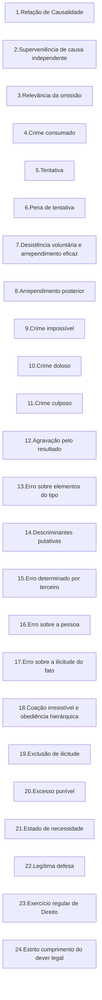

 

<b>CENTRO UNIVERSITÁRIO UNIESP</b> 
<b>Bacharelado em Direito</b> 
<b>Disciplina</b>: TEORIA DO DELITO (Direito Penal I) 
<b>Professora</b>: GABRIELLA HENRIQUES DA NOBREGA 
<b>Data</b>: 04 de janeiro de 2025, sábado 
 
<b>Aluno</b>: Daniel Lima Claudino / 2º período 
 

<table align="right" border="0">
  <tr>
    <td align="center" valign="top">
      <a href="../../../README.md">
         Início deste  Repositório
      </a>
    </td>
    <td align="center" valign="top">
      <a href="../README.md">
         Sumário da Fonte
      </a>
    </td>
    <td align="center" valign="top">
         Baixar em PDF
    </td>
  </tr>
</table>     

<h1>Visão Geral</h1>

## Título II - Da pena

